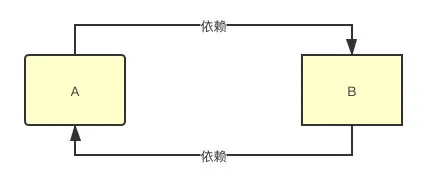
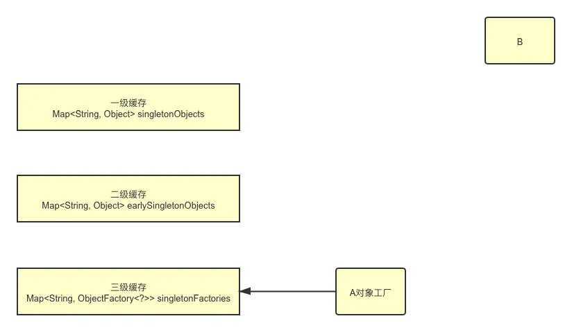
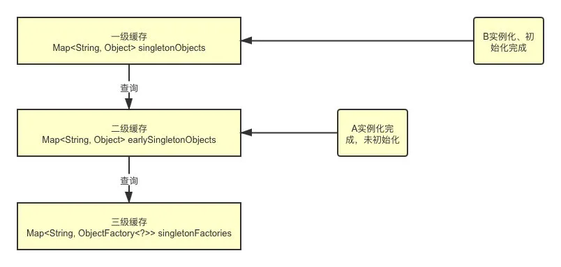
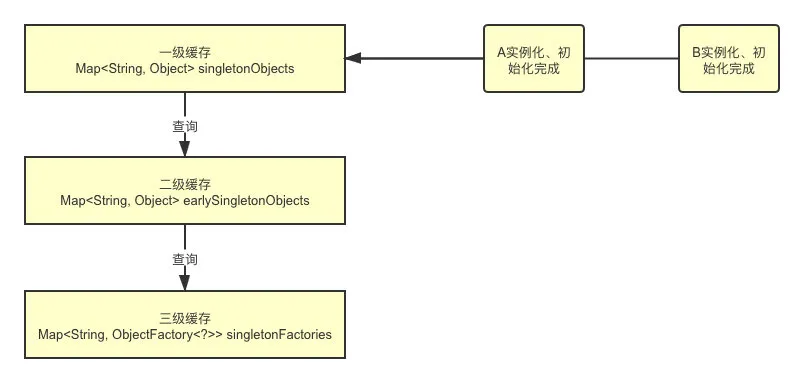
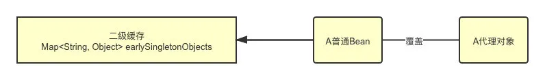

### 什么是Spring beans
那些形成Spring应用的主干的java对象。它们被Spring IOC容器初始化，装配，和管理。这些beans通过容器中配置的元数据创建。比如，以XML文件中的形式定义。

### Spring框架设计的核心：IoC容器和AOP模块。
- 通过IoC容器管理POJO对象以及他们之间的耦合关系；通过AOP以动态非侵入的方式增强服务。
- IoC让相互协作的组件保持松散的耦合，而AOP编程允许你把遍布于应用各层的功能分离出来形成可重用的功能组件。

### 什么是Spring IOC 容器
Ioc即控制反转， 意思是将传统的代码对对象的控制权交给容器，通过容器实现对对象的装配和管理。

### Ioc有什么作用
Spring Ioc负责创建对象，管理对象，装配对象，配置对象，并且管理这些对象的生命周期
- 管理对象的创建、维护依赖关系
- 解耦，用容器去维护具体的对象
- 托管的类的产生过程，比如我们需要在类的产生过程中做一些处理，最直接的例子就是代理，如果有容器程序可以把这部分处理交给容器，应用程序则无需去关心类是如何完成代理的

### Ioc是怎么实现的
反射 + 工厂模式
```java
interface Fruit {
    public abstract void eat();
}
class Apple implements Fruit {
    public void eat() {
        System.out.println("Apple");
    }
}
class Orange implements Fruit {
    public void eat() {
        System.out.println("Orange");
    }
}

class Factory {
    public static Fruit getInstance(String ClassName) {
        Fruit f = (Fruit)Class.forName(ClassName).newInstance();
    }
}
public static void main(String[] a) {
    Fruit f = Factory.getInstance("io.github.dunwu.spring.Apple");
    if (f != null) {
        f.eat();
    }
}
```

### 说说Spring 里用到了哪些设计模式
- 单例模式：Spring 中的 Bean 默认情况下都是单例的。无需多说。
- 工厂模式：工厂模式主要是通过 BeanFactory 和 ApplicationContext 来生产 Bean 对象。
- 代理模式：最常见的 AOP 的实现方式就是通过代理来实现，Spring主要是使用 JDK 动态代理和 CGLIB 代理。
- 模板方法模式：主要是一些对数据库操作的类用到，比如 JdbcTemplate、JpaTemplate，因为查询数据库的建立连接、执行查询、关闭连接几个过程，非常适用于模板方法。

### BeanFactory和ApplicationContext的关系
- BeanFactory 简单粗暴，可以理解为就是个 HashMap，Key 是 BeanName，Value 是 Bean 实例。通常只提供注册（put），获取（get）这两个功能。我们可以称之为 “低级容器”
- ApplicationContext 继承了多个接口，比 BeanFactory 多了更多的功能，例如资源的获取，支持多种消息（例如 JSP tag 的支持），对 BeanFactory 多了工具级别的支持等待。

### 依赖注入
组件之间的依赖关系由容器在应用系统运行期来决定，也就是由容器动态的将某种依赖关系的目标对象实例注入到应用系统的各个关联组件当中。

### 依赖注入的基本原则
应用组件不应该负责查找资源或者其他依赖的协作对象。配置对象的工作应该由IoC容器负责，“查找资源”的逻辑应该从应用组件的代码中抽取出来，交给IoC容器负责。

### 有哪些不同类型的依赖注入实现方式
- setter方法注入：容器通过调用无参构造器或无参static工厂方法实例化bean之后，调用该bean的setter方法，即实现了基于setter的依赖注入。
- 构造器注入：通过容器触发一个类的构造器来实现的，该类有一系列参数，每个参数代表一个对其他类的依赖。

### 如何解决循环依赖问题
首先，Spring 解决循环依赖有两个前提条件：
1. 不全是构造器方式的循环依赖
2. 必须是单例
本质上解决循环依赖的问题就是使用三级缓存，通过三级缓存提前拿到未初始化的对象。
- 第一级缓存：用来保存实例化、初始化都完成的对象
- 第二级缓存：用来保存实例化完成，但是未初始化完成的对象
- 第三级缓存：用来保存一个对象工厂，提供一个匿名内部类，用于创建二级缓存中的对象
假设一个简单的循环依赖场景，A、B互相依赖。

A对象的创建过程：
1. 创建对象A，实例化的时候把A对象工厂放入三级缓存
   
2. A注入属性时，发现依赖B，转而去实例化B
3. 同样创建对象B，注入属性时发现依赖A，依次从一级到三级缓存查询A，从三级缓存通过对象工厂拿到A，把A放入二级缓存，同时删除三级缓存中的A，此时，B已经实例化并且初始化完成，把B放入一级缓存。
   
4. 接着继续创建A，顺利从一级缓存拿到实例化且初始化完成的B对象，A对象创建也完成，删除二级缓存中的A，同时把A放入一级缓存
5. 最后，一级缓存中保存着实例化、初始化都完成的A、B对象
    
因此，由于把实例化和初始化的流程分开了，所以如果都是用构造器的话，就没法分离这个操作，所以都是构造器的话就无法解决循环依赖的问题了。
#### 为什么要三级缓存？二级不行吗？
- 不可以，主要是为了生成代理对象。因为三级缓存中放的是生成具体对象的匿名内部类，他可以生成代理对象，也可以是普通的实例对象。使用三级缓存主要是为了保证不管什么时候使用的都是一个对象。
- 假设只有二级缓存的情况，往二级缓存中放的是一个普通的Bean对象，BeanPostProcessor去生成代理对象之后，覆盖掉二级缓存中的普通Bean对象，那么多线程环境下可能取到的对象就不一致了。
   

### SpringBean 生命周期简单概括为4个阶段：
1. 实例化，创建一个Bean对象
2. 填充属性，为属性赋值
3. 初始化
  - 如果实现了xxxAware接口，通过不同类型的Aware接口拿到Spring容器的资源
  - 如果实现了BeanPostProcessor接口，则会回调该接口的postProcessBeforeInitialzation和postProcessAfterInitialization方法
  - 如果配置了init-method方法，则会执行init-method配置的方法
4. 销毁 
  - 容器关闭后，如果Bean实现了DisposableBean接口，则会回调该接口的destroy方法   
  - 如果配置了destroy-method方法，则会执行destroy-method配置的方法

### 类的作用域
- singleton : bean在每个Spring ioc 容器中只有一个实例。
- prototype：一个bean的定义可以有多个实例。
- request：每次http请求都会创建一个bean，该作用域仅在基于web的Spring ApplicationContext情形下有效。
- session：在一个HTTP Session中，一个bean定义对应一个实例。该作用域仅在基于web的Spring ApplicationContext情形下有效。
- global-session：在一个全局的HTTP Session中，一个bean定义对应一个实例。该作用域仅在基于web的Spring ApplicationContext情形下有效。

### 有状态和无状态
有状态就是有数据存储功能。无状态就是不会保存数据。

### 单例bean是否是线程安全的
不是，spring 框架并没有对单例 bean 进行多线程的封装处理。
想改成线程安全，最简单的就是使用prototype，这样相当与每次都new一个bean

### @Autowired和@Resource之间的区别：
@Autowired默认是按照类型装配注入的，默认情况下它要求依赖对象必须存在（可以设置它required属性为false）
@Resource默认是按照名称来装配注入的，只有当找不到与名称匹配的bean才会按照类型来装配注入

### spring 的事务隔离:
- ISOLATION_DEFAULT，用底层数据库的隔离级别
- ISOLATION_READ_UNCOMMITTED， 未提交读，事务未提交前，就可被其他事务读取，会出现幻读、脏读、不可重复读
- ISOLATION_READ_COMMITTED：提交读，一个事务提交后才能被其他事务读取到，会造成幻读、不可重复读，SQL server 的默认级别；
- ISOLATION_REPEATABLE_READ：可重复读，保证多次读取同一个数据时，其值都和事务开始时候的内容是一致，禁止读取到别的事务未提交的数据，可能会造成幻读，MySQL的默认级别；
- ISOLATION_SERIALIZABLE：序列化，代价最高最可靠的隔离级别，该隔离级别能防止脏读、不可重复读、幻读。

### Spring AOP里面的几个定义：
- 切面（Aspect）：切面是通知和切点的结合。通知和切点共同定义了切面的全部内容。 在Spring AOP中，切面可以使用通用类（基于模式的风格） 或者在普通类中以 @Aspect 注解来实现。
- 通知（Advice）：在AOP术语中，切面的工作被称为通知。Spring切面可以应用5种类型的通知：
  1. 前置通知（Before）：在目标方法被调用之前调用通知功能；
  2. 后置通知（After）：在目标方法完成之后调用通知，此时不会关心方法的输出是什么；
  3. 返回通知（After-returning ）：在目标方法成功执行之后调用通知；
  4. 异常通知（After-throwing）：在目标方法抛出异常后调用通知；
  5. 环绕通知（Around）：通知包裹了被通知的方法，在被通知的方法调用之前和调用之后执行自定义的行为。
- 切点（Pointcut）：匹配通知所要织入的一个或多个连接点。我们通常使用明确的类和方法名称，或是利用正则表达式定义所匹配的类和方法名称来指定这些切点。
- 织入（Weaving）：织入是把切面应用到目标对象并创建新的代理对象的过程。在目标对象的生命周期里有多少个点可以进行织入：
  1. 编译期：切面在目标类编译时被织入。AspectJ的织入编译器是以这种方式织入切面的。
  2. 类加载期：切面在目标类加载到JVM时被织入。需要特殊的类加载器，它可以在目标类被引入应用之前增强该目标类的字节码。AspectJ5的加载时织入就支持以这种方式织入切面。
  3. 运行期：切面在应用运行的某个时刻被织入。一般情况下，在织入切面时，AOP容器会为目标对象动态地创建一个代理对象。SpringAOP就是以这种方式织入切面。
- 连接点（Join point）：指方法，在Spring AOP中，一个连接点总是代表一个方法的执行。应用可能有数以千计的时机通知。这些时机被称为连接点。连接点是在应用执行过程中能够插入切面的一个点。这个点可以是调用方法时、抛出异常时、甚至修改一个字段时。切面代码可以利用这些点插入到应用的正常流程之中，并添加新的行为。
- 引入（Introduction）：引入允许我们向现有类添加新方法或属性。
- 目标对象（Target Object）： 被一个或者多个切面（aspect）所通知（advise）的对象。它通常是一个代理对象。也有人把它叫做 被通知（adviced） 对象。 既然Spring AOP是通过运行时代理实现的，这个对象永远是一个 被代理（proxied） 对象。

### 同一个aspect，不同advice的执行顺序：
- 没有异常情况下的执行顺序：
  1.  around before advice
  2.  before advice
  3.  target method 执行
  4.  around after advice
  5.  after advice
  6.  afterReturning
- 有异常情况下的执行顺序：
  1.  around before advice
  2.  before advice
  3.  target method 执行
  4.  around after advice
  5.  after advice
  6.  afterThrowing:异常发生
  7.  java.lang.RuntimeException: 异常发生

### 切面配置示例：
```xml
<aop:config>
    <!--统一异常拦截 -->
    <aop:aspect id="exceptionAspect" ref="dtoParamCheckInterceptor">
        <aop:pointcut id="exceptionPointcut" expression="execution(* com.qunar.train.glory.service.impl.*.*(..))"/>
        <aop:around method="process"  pointcut-ref="exceptionPointcut"/>
    </aop:aspect>
</aop:config>
```

### aop底层实现
- JDK动态代理：核心是实现InvocationHandler接口，并且实现接口中的invoke方法
```java
public Object invoke(Object proxy, Method method, Object[] args) throws Throwable {
    // 程序执行前加入逻辑，MethodBeforeAdviceInterceptor
    System.out.println("before-----------------------------");
    // 程序执行
    Object result = method.invoke(target, args);
    // 程序执行后加入逻辑，MethodAfterAdviceInterceptor
    System.out.println("after------------------------------");
    return result;
}
```
使用语法
```java
Service aService = new ServiceImpl();
MyInvocationHandler handler = new MyInvocationHandler(aService);
// Proxy为InvocationHandler实现类动态创建一个符合某一接口的代理实例
Service aServiceProxy = (Service) Proxy.newProxyInstance(aService.getClass().getClassLoader(), aService.getClass().getInterfaces(), handler);
```
- cglib代理：核心是实现MethodInterceptor接口，实现intercept方法。该代理中在add方法前后加入了自定义的切面逻辑
```java
public Object intercept(Object object, Method method, Object[] args, MethodProxy proxy) throws Throwable {
    // 添加切面逻辑（advise），此处是在目标类代码执行之前，即为MethodBeforeAdviceInterceptor。
    System.out.println("before-------------");
    // 执行目标类add方法
    proxy.invokeSuper(object, args);
    // 添加切面逻辑（advise），此处是在目标类代码执行之后，即为MethodAfterAdviceInterceptor。
    System.out.println("after--------------");
    return null;
}
```
还需要获取增强的目标类的工厂Factory，其中增强的方法类对象是由Enhancer来实现的：
```java
public static Base getInstance(CglibProxy proxy) {
    Enhancer enhancer = new Enhancer();
    enhancer.setSuperclass(Base.class);
    //回调方法的参数为代理类对象CglibProxy，最后增强目标类调用的是代理类对象CglibProxy中的intercept方法
    enhancer.setCallback(proxy);
    //此刻，base不是单纯的目标类，而是增强过的目标类
    Base base = (Base) enhancer.create();
    return base;
}
```
使用语法：
```java
CglibProxy proxy = new CglibProxy();
// base为生成的增强过的目标类
Base base = Factory.getInstance(proxy);
base.add();
```

### springMVC工作流程
- 用户发送请求至前端控制器DispatcherServlet；
- DispatcherServlet收到请求后，调用HandlerMapping处理器映射器，请求获取Handler；
- 处理器映射器根据请求url找到具体的处理器，生成处理器对象及处理器拦截器(如果有则生成)一并返回给DispatcherServlet；
- DispatcherServlet 调用 HandlerAdapter处理器适配器；
- HandlerAdapter 经过适配调用 具体处理器(Handler，也叫后端控制器)；
- Handler执行完成返回ModelAndView；
- HandlerAdapter将Handler执行结果ModelAndView返回给DispatcherServlet；
- DispatcherServlet将ModelAndView传给ViewResolver视图解析器进行解析；
- ViewResolver解析后返回具体View；
- DispatcherServlet对View进行渲染视图（即将模型数据填充至视图中）
- DispatcherServlet响应用户。

### 什么是 Spring Boot？
Spring Boot 是 Spring 开源组织下的子项目，是 Spring 组件一站式解决方案，主要是简化了使用 Spring 的难度，简省了繁重的配置，提供了各种启动器，开发者能快速上手。

### 注解开发