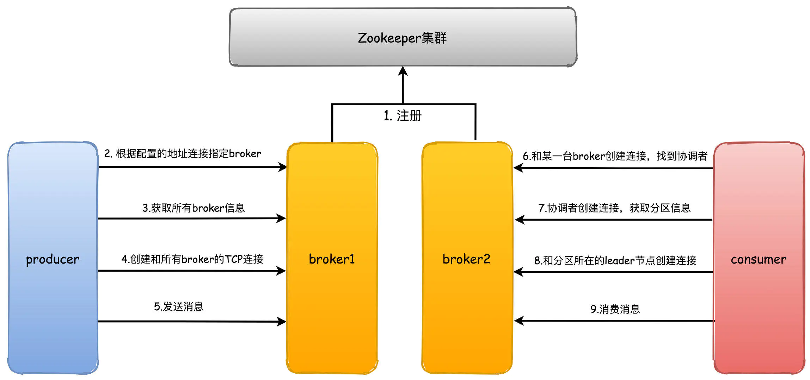
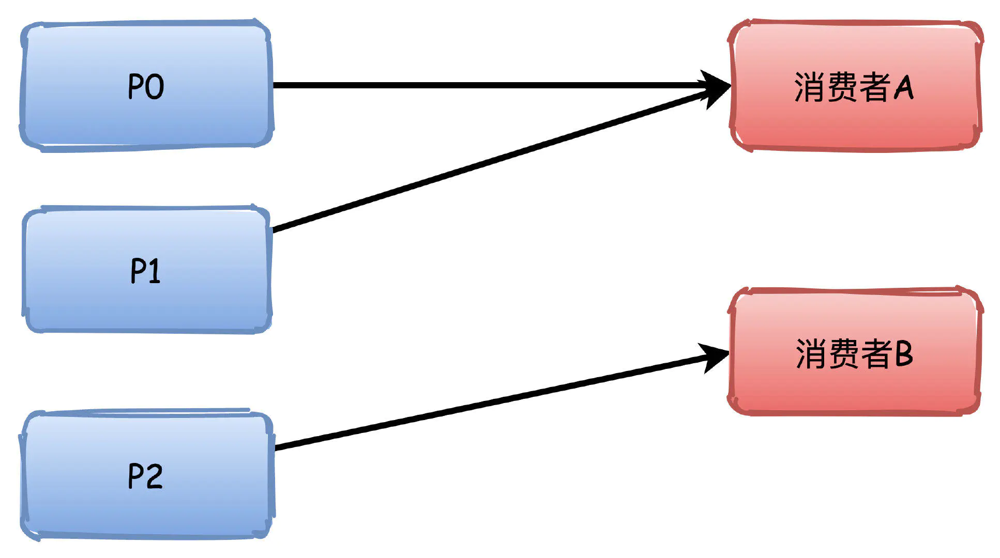
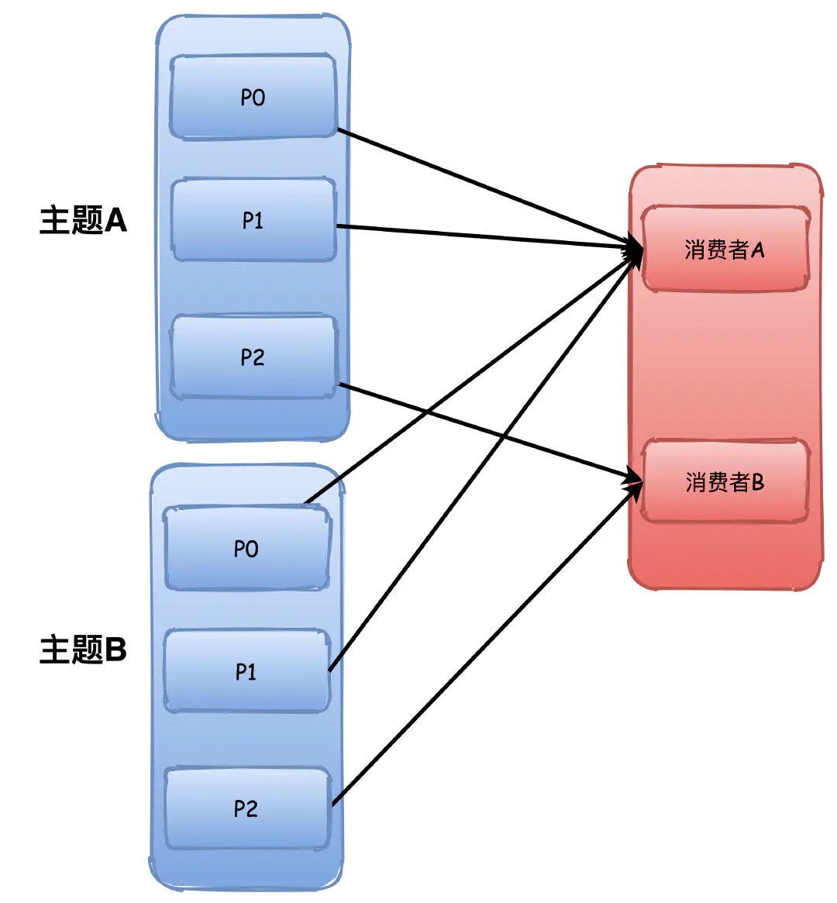
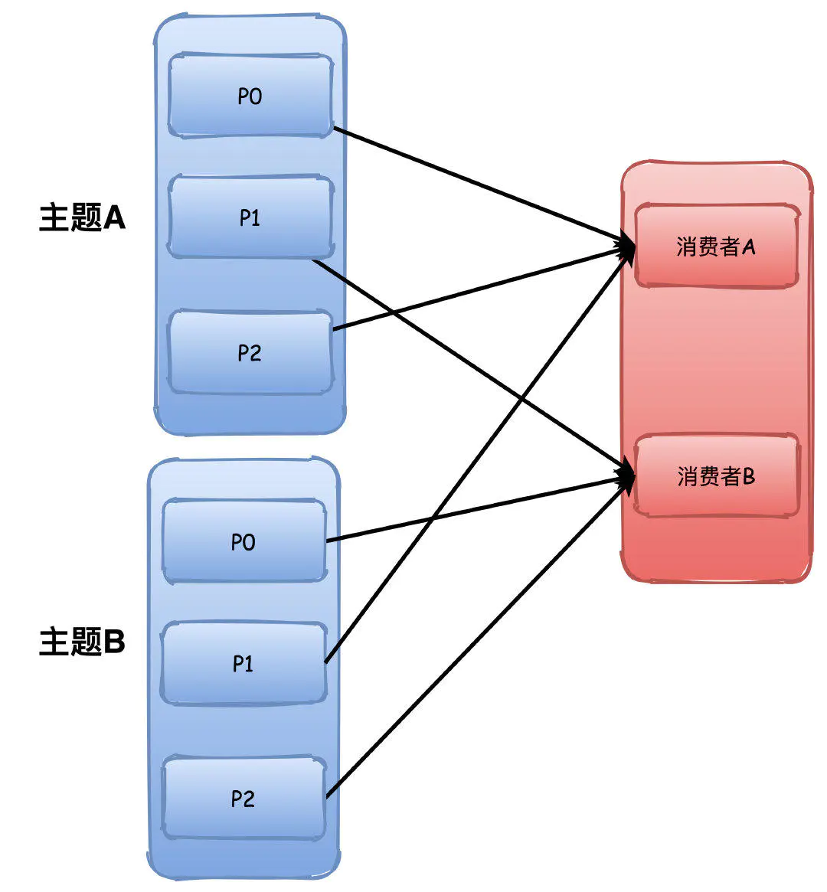
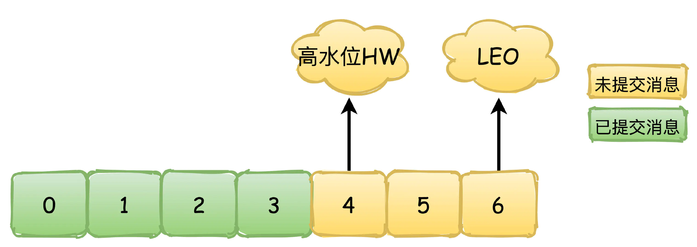
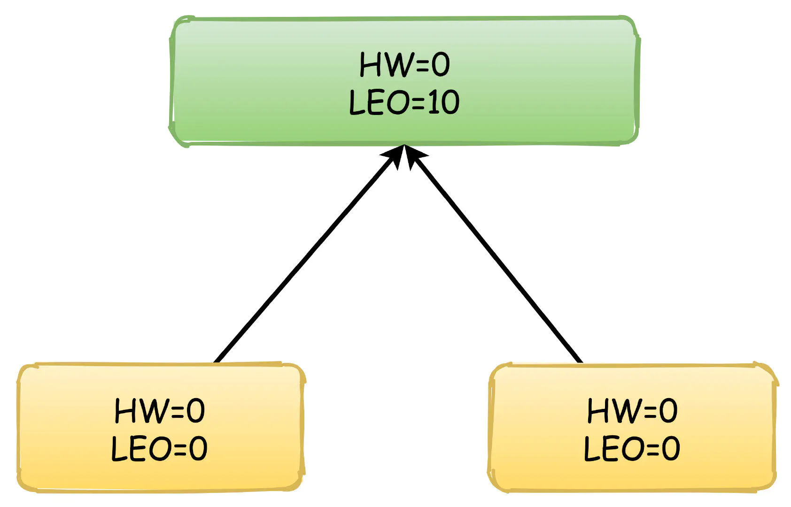
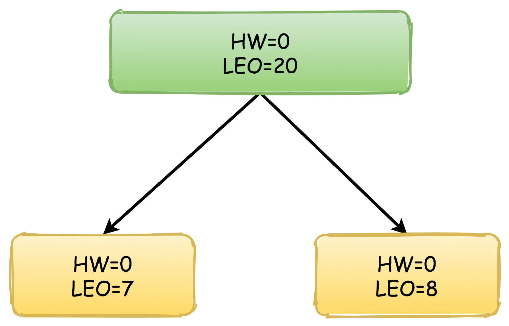
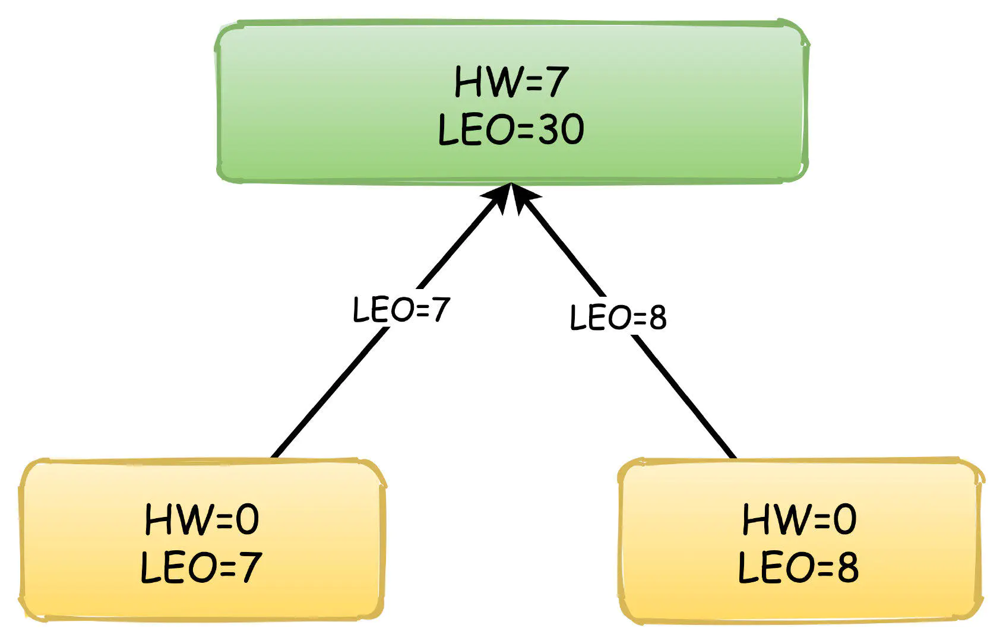
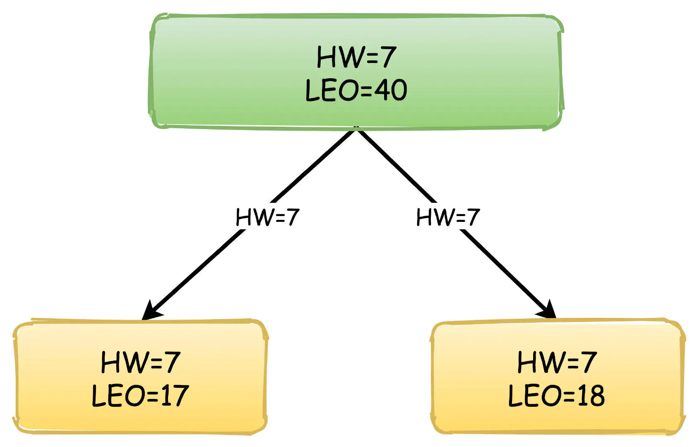

### 说说你对kafka的理解
kafka是一个流式数据处理平台，他具有消息系统的能力，也有实时流式数据处理分析能力，只是我们更多的偏向于把他当做消息队列系统来使用。大致可以分为三层：
- Zookeeper，相当于注册中心，他负责kafka集群元数据的管理，以及集群的协调工作，在每个kafka的broker启动的时候去连接到Zookeeper，把自己注册到Zookeeper当中
- kafka的核心层
  - record：代表消息
  - topic：主题，消息都会由一个主题方式来组织，可以理解为对于消息的一个分类
  - producer：生产者，负责发送消息
  - consumer：消费者，负责消费消息
  - broker：kafka服务器
  - partition：分区，主题会由多个分区组成，通常每个分区的消息都是按照顺序读取的，不同的分区无法保证顺序性。分区主要目的就是为了提高系统的伸缩能力，通过分区，消息的读写可以负载均衡到多个不同的节点上
  - Leader/Follower：分区的副本。为了保证高可用，分区都会有一些副本，每个分区都会有一个Leader主副本负责读写数据，Follower从副本只负责和Leader副本保持数据同步，不对外提供任何服务
  - offset：偏移量，分区中的每一条消息都会根据时间先后顺序有一个递增的序号，这个序号就是offset偏移量
  - Consumer group：消费者组，由多个消费者组成，一个组内只会由一个消费者去消费一个分区的消息
  - Coordinator：协调者，主要是为消费者组分配分区以及重平衡Rebalance操作
  - Controller：控制器，其实就是一个broker而已，用于协调和管理整个Kafka集群，他会负责分区Leader选举、主题管理等工作，在Zookeeper第一个创建临时节点的broker就会成为控制器
  

- 存储层，用来保存kafka的核心数据，他们都会以日志的形式最终写入磁盘中。

### 消息队列模型知道吗？kafka是怎么做到支持这两种模型的？
对于传统的消息队列系统支持两个模型：
- 点对点：也就是消息只能被一个消费者消费，消费完后消息删除
- 发布订阅：相当于广播模式，消息可以被所有消费者消费
  
kafka通过Consumer Group同时支持了这两个模型。
- 如果说所有消费者都属于一个Group，消息只能被同一个Group内的一个消费者消费，那就是点对点模式。
- 如果每个消费者都是一个单独的Group，那么就是发布订阅模式。

### 能说说kafka通信过程原理吗？
- 首先kafka broker启动的时候，会去向Zookeeper注册自己的ID（创建临时节点），这个ID可以配置也可以自动生成，同时会去订阅Zookeeper的brokers/ids路径，当有新的broker加入或者退出时，可以得到当前所有broker信息
- 生产者启动的时候会指定bootstrap.servers，通过指定的broker地址，Kafka就会和这些broker创建TCP连接（通常我们不用配置所有的broker服务器地址，否则kafka会和配置的所有broker都建立TCP连接）
- 随便连接到任何一台broker之后，然后再发送请求获取元数据信息（包含有哪些主题、主题都有哪些分区、分区有哪些副本，分区的Leader副本等信息）
- 接着就会创建和所有broker的TCP连接
- 之后就是发送消息的过程
- 消费者和生产者一样，也会指定bootstrap.servers属性，然后选择一台broker创建TCP连接，发送请求找到协调者所在的broker
- 然后再和协调者broker创建TCP连接，获取元数据
- 根据分区Leader节点所在的broker节点，和这些broker分别创建连接
- 最后开始消费消息
  

### 发送消息时如何选择分区的？
- 轮询，按照顺序消息依次发送到不同的分区；常见于没有指定key的情况，会执行默认的轮询负载均衡策略，比如第一条消息落在P0，第二条消息落在P1，然后第三条又在P1。
- 随机，随机发送到某个分区
- 如果消息指定key，那么会根据消息的key进行hash，然后对partition分区数量取模，决定落在哪个分区上，所以，对于相同key的消息来说，总是会发送到同一个分区上，也是我们常说的消息分区有序性。很常见的场景就是我们希望下单、支付消息有顺序，这样以订单ID作为key发送消息就达到了分区有序性的目的。
- 还可以通过实现Partitioner接口，重写configure和partition方法来达到自定义分区的效果。

### 你觉得为什么需要分区？有什么好处？
- 分区带来了负载均衡和横向扩展的能力。
- 如果说不分区的话，我们发消息写数据都只能保存到一个节点上，这样的话就算这个服务器节点性能再好最终也支撑不住。实际上分布式系统都面临这个问题，要么收到消息之后进行数据切分，要么提前切分，kafka正是选择了前者，通过分区可以把数据均匀地分布到不同的节点。
- 发送消息时可以根据分区的数量落在不同的Kafka服务器节点上，提升了并发写消息的性能，消费消息的时候又和消费者绑定了关系，可以从不同节点的不同分区消费消息，提高了读消息的能力。
- 分区又引入了副本，冗余的副本保证了Kafka的高可用和高持久性。

### 消费者组是什么
Kafka中的消费者组订阅topic主题的消息，一般来说消费者的数量最好要和所有主题分区的数量保持一致最好（举例子用一个主题，实际上当然是可以订阅多个主题）。
- 当消费者数量小于分区数量的时候，那么必然会有一个消费者消费多个分区的消息。
- 而消费者数量超过分区的数量的时候，那么必然会有消费者没有分区可以消费。
所以，消费者组的好处一方面在上面说到过，可以支持消费多种消息，另外的话根据消费者和分区的消费关系，支撑横向扩容伸缩。

### 什么是重平衡
而重平衡Rebalance就是指的有新消费者加入的情况，比如刚开始我们只有消费者A在消费消息，过了一段时间消费者B和C加入了，这时候分区就需要重新分配，这就是重平衡，也可以叫做再平衡，但是重平衡的过程和我们的GC时候STW很像，会导致整个消费群组停止工作，重平衡期间都无法消息消息。另外，发生重平衡并不是只有这一种情况，因为消费者和分区总数是存在绑定关系的，上面也说了，消费者数量最好和所有主题的分区总数一样。
- 只要消费者数量、主题数量（比如用的正则订阅的主题）、分区数量任何一个发生改变，都会触发重平衡。
- 旧版本的重平衡过程主要通过ZK监听器的方式来触发，每个消费者客户端自己去执行分区分配算法。
- 新版本则是通过协调者来完成，每一次新的消费者加入都会发送请求给协调者去获取分区的分配，这个分区分配的算法逻辑由协调者来完成。

### 重平衡的过程
- 重平衡的机制依赖消费者和协调者之间的心跳来维持，消费者会有一个独立的线程去定时发送心跳给协调者，这个可以通过参数heartbeat.interval.ms来控制发送心跳的间隔时间。
- 每个消费者第一次加入组的时候都会向协调者发送JoinGroup请求，第一个发送这个请求的消费者会成为“群主”，协调者会返回组成员列表给群主
- 群主执行分区分配策略，然后把分配结果通过SyncGroup请求发送给协调者，协调者收到分区分配结果
- 其他组内成员也向协调者发送SyncGroup，协调者把每个消费者的分区分配分别响应给他们
  

### 讲讲分区分配策略
主要有三种:
- Range
  - 默认的策略。大概意思就是对分区进行排序，排序越靠前的分区能够分配到更多的分区。
  - 比如有3个分区，消费者A排序更靠前，所以能够分配到P0\P1两个分区，消费者B就只能分配到一个P2，如果是4个分区的话，那么他们会刚好都是分配到2个。
  
  - 这个分配策略会有点小问题，他是根据主题进行分配，所以如果消费者组订阅了多个主题，那就有可能导致分区分配不均衡。比如两个主题的P0\P1都被分配给了A，这样A有4个分区，而B只有2个，如果这样的主题数量越多，那么不均衡就越严重。
  
- RoundRobin
  - 也就是我们常说的轮询了，这个就比较简单了，不画图你也能很容易理解。
  - 这个会根据所有的主题进行轮询分配，不会出现Range那种主题越多可能导致分区分配不均衡的问题。
  - P0->A，P1->B，P1->A。。。以此类推
  
- Sticky
  - 主要考虑的是在分配均衡的前提下，让分区的分配更小的改动。
  - 比如之前P0\P1分配给消费者A，那么下一次尽量还是分配给A。
  - 这样的好处就是连接可以复用，要消费消息总是要和broker去连接的，如果能够保持上一次分配的分区的话，那么就不用频繁的销毁创建连接了。

### 如何保证消息可靠性？
- 生产者发送消息丢失
  - kafka支持3种方式发送消息，（基本上所有的消息队列都是这样玩的）
    - 发送并忘记，直接调用发送send方法，不管结果，虽然可以开启自动重试，但是肯定会有消息丢失的可能
    - 同步发送，同步发送返回Future对象，我们可以知道发送结果，然后进行处理
    - 异步发送，发送消息，同时指定一个回调函数，根据结果进行相应的处理
    为了保险起见，一般我们都会使用异步发送带有回调的方式进行发送消息，再设置参数为发送消息失败不停地重试。
  - acks=all，这个参数有可以配置0|1|all。
    - 0表示生产者写入消息不管服务器的响应，可能消息还在网络缓冲区，服务器根本没有收到消息，当然会丢失消息。
    - 1表示至少有一个副本收到消息才认为成功，一个副本那肯定就是集群的Leader副本了，但是如果刚好Leader副本所在的节点挂了，Follower没有同步这条消息，消息仍然丢失了。
    配置all的话表示所有ISR都写入成功才算成功，那除非所有ISR里的副本全挂了，消息才会丢失。
  - retries=N，设置一个非常大的值，可以让生产者发送消息失败后不停重试

- kafka自身消息丢失
kafka因为消息写入是通过PageCache异步写入磁盘的，因此仍然存在丢失消息的可能。针对kafka自身丢失的可能设置参数：
  - replication.factor=N，设置一个比较大的值，保证至少有2个或者以上的副本。
  - min.insync.replicas=N，代表消息如何才能被认为是写入成功，设置大于1的数，保证至少写入1个或者以上的副本才算写入消息成功。
  - unclean.leader.election.enable=false，这个设置意味着没有完全同步的分区副本不能成为Leader副本，如果是true的话，那些没有完全同步Leader的副本成为Leader之后，就会有消息丢失的风险。

- 消费者消息丢失
  - enable.auto.commit=false，关闭自动提交位移即可，改为业务处理成功手动提交。
    因为重平衡发生的时候，消费者会去读取上一次提交的偏移量，自动提交默认是每5秒一次，这会导致重复消费或者丢失消息。
  - auto.offset.reset=earliest，这个参数代表没有偏移量可以提交或者broker上不存在偏移量的时候，消费者如何处理。earliest代表从分区的开始位置读取，可能会重复读取消息，但是不会丢失，消费方一般我们肯定要自己保证幂等，另外一种latest表示从分区末尾读取，那就会有概率丢失消息。

综合这几个参数设置，我们就能保证消息不会丢失，保证了可靠性。

### 讲讲副本和它的同步原理吧
- Kafka副本的分为Leader副本和Follower副本，和其他的比如Mysql不一样的是，Kafka中只有Leader副本会对外提供服务，Follower副本只是单纯地和Leader保持数据同步，作为数据冗余容灾的作用。
- 在Kafka中我们把所有副本的集合统称为AR（Assigned Replicas），和Leader副本保持同步的副本集合称为ISR（InSyncReplicas）。
- ISR是一个动态的集合，维持这个集合会通过replica.lag.time.max.ms参数来控制，这个代表落后Leader副本的最长时间，默认值10秒，所以只要Follower副本没有落后Leader副本超过10秒以上，就可以认为是和Leader同步的（简单可以认为就是同步时间差）。

另外还有两个关键的概念用于副本之间的同步：
- HW（High Watermark）：高水位，也叫做复制点，表示副本间同步的位置。如下图所示，绿色表示已经提交的消息，这些消息已经在副本之间进行同步，消费者可以看见这些消息并且进行消费，黄色的则是表示未提交的消息，可能还没有在副本间同步，这些消息对于消费者是不可见的。
- LEO（Log End Offset）：下一条待写入消息的位移
  
  
副本间同步的过程依赖的就是HW和LEO的更新，具体步骤如下：
- 生产者不停地向Leader写入数据，这时候Leader的LEO可能已经达到了10，但是HW依然是0，两个Follower向Leader请求同步数据，他们的值都是0。
  
- 消息还在继续写入，Leader的LEO值又发生了变化，两个Follower也各自拉取到了自己的消息，于是更新自己的LEO值，但是这时候Leader的HW依然没有改变。
  
- Follower再次向Leader拉取数据，这时候Leader会更新自己的HW值，取Follower中的最小的LEO值来更新。
  
- Leader响应自己的HW给Follower，Follower更新自己的HW值，因为又拉取到了消息，所以再次更新LEO，流程以此类推。
  

### Kafka为什么快
- 顺序IO
kafka写消息到分区采用追加的方式，也就是顺序写入磁盘，不是随机写入，这个速度比普通的随机IO快非常多，几乎可以和网络IO的速度相媲美。
- Page Cache和零拷贝
kafka在写入消息数据的时候通过mmap内存映射的方式，不是真正立刻写入磁盘，而是利用操作系统的文件缓存PageCache异步写入，提高了写入消息的性能，另外在消费消息的时候又通过sendfile实现了零拷贝。
- 批量处理和压缩
Kafka在发送消息的时候不是一条条的发送的，而是会把多条消息合并成一个批次进行处理发送，消费消息也是一个道理，一次拉取一批次的消息进行消费。
并且Producer、Broker、Consumer都使用了优化后的压缩算法，发送和消息消息使用压缩节省了网络传输的开销，Broker存储使用压缩则降低了磁盘存储的空间。
