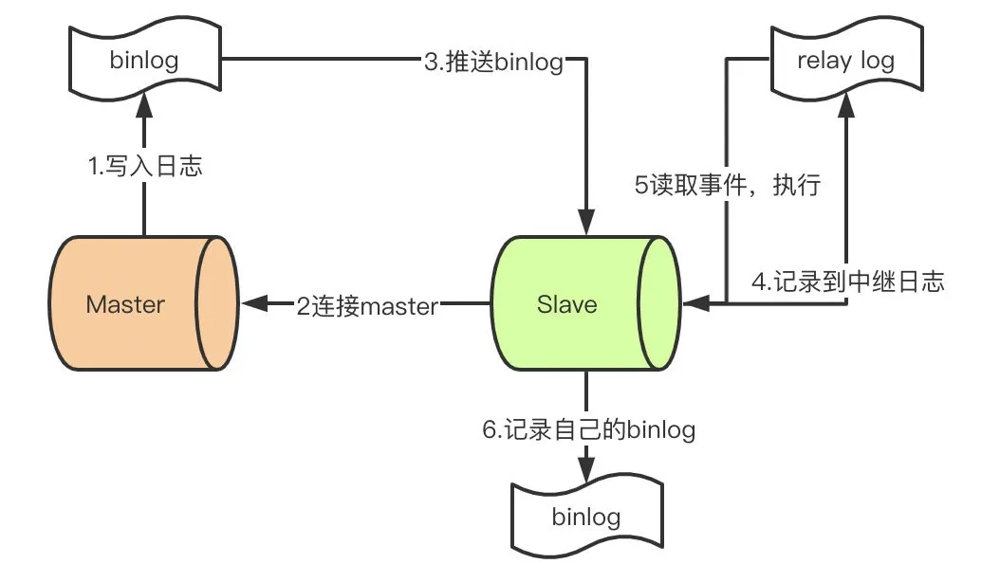

### mysql的存储引擎都有哪些？有什么不同点
- 存储引擎有三个：innodb、myisam、memory
- myisam相比innodb，缺少了行级锁，而且不支持外键、不支持事务、不支持哈希索引
- myisam的索引和数据是分开存储的，分3个不同的文件
- myisam的索引主要是非聚簇索引，innodb的主键索引是聚簇索引。聚簇索引的最大特点是在B+树的叶子节点直接储存数据

### mysql为什么要有锁
当数据库有并发事务的时候，可能会产生数据的不一致，这时候需要一些机制来保证访问的次序，锁机制就是这样的一个机制。

### 从锁的类别上分MySQL都有哪些锁呢
- 按照锁的类别进行划分：共享锁和排它锁
- 共享锁：又叫做读锁。 当用户要进行数据的读取时，对数据加上共享锁。共享锁可以同时加上多个。
- 排它锁：又叫做写锁。 当用户要进行数据的写入时，对数据加上排它锁。排它锁只可以加一个，他和其他的排它锁，共享锁都相斥。

### InnoDB存储引擎的锁的算法有三种
- Record lock：单个行记录上的锁
- Gap lock：间隙锁，锁定一个范围，不包括记录本身
- Next-key lock：record+gap 锁定一个范围，包含记录本身

### 三种锁的一些特点
- innodb对于行的查询使用next-key lock，临键锁是为了解决幻读问题的，默认是左开右闭
- 当查询条件不能覆盖到记录时，临键锁退化为间隙锁gap lock
- 当查询是唯一索引的唯一行时，临键锁退化为记录锁record lock

### 脏读、不可重复读、幻读
- 脏读：其他事务未提交的记录，能被读到
- 不可重复读：两次读取到的记录不一样，原因是两次读的动作在其它事务提交前后
- 幻读：两次读取的条数不一样，innodb使用临键锁解决这个问题，实际上就是让加锁的范围进行一定程度的扩大

### mvcc多版本并发控制
- 核心是对每条记录多加两个字段：数据行的版本号 （DB_TRX_ID）、删除版本号 (DB_ROLL_PT)
- 插入：将全局事务ID记录到列 DB_TRX_ID 中去
- 删除：delete之后数据并没有被真正删除，而是对删除版本号做改变
- 修改：先复制一条当前记录行数据，同时标记这条数据的数据行版本号为当前事务版本号，最后把原来的数据行的删除版本号标记为当前事务版本号。
- 查询：
  - 查找数据行版本号小于当前事务版本号的数据行记录，确保读取到的数据是当前事务开始前已经存在的数据，或者是自身事务改变过的数据
  - 查找删除版本号要么为NULL，要么大于当前事务版本号的记录，确保查询出来的数据行记录在事务开启之前没有被删除
- 系统会周期性整理（sweep through）以真实删除老的、过时的数据。

### 索引覆盖问题
索引覆盖的意思就是要查询的所有字段都包含在索引中，通过一个索引结构就能查出来，不需要回表

### mysql联合索引
当创建**(a,b,c)联合索引时，相当于创建了(a)单列索引**，(a,b)联合索引以及**(a,b,c)联合索引**
想要索引生效的话,只能使用 a和a,b和a,b,c三种组合；当然，a,c组合也可以，但实际上只用到了a的索引，c并没有用到！

### 加索引的一些原则
- 需要加索引的字段，要在where条件中
- 数据量少的字段不需要加索引；因为建索引有一定开销，如果数据量小则没必要建索引（速度反而慢）
- 避免在where子句中使用or来连接条件，因为如果俩个字段中有一个没有索引的话，引擎会放弃索引而产生全表扫描
- 联合索引比对每个列分别建索引更有优势，因为索引建立得越多就越占磁盘空间，在更新数据的时候速度会更慢。另外建立联合索引时，顺序也是需要注意的，应该将常用的字段放在前面，这样筛选的力度会更大，效率更高。

### 说说mysql主从同步怎么做的吧
首先先了解mysql主从同步的原理
1. master提交完事务后，写入binlog
2. slave连接到master，获取binlog
3. master创建dump线程，推送binglog到slave
4. slave启动一个IO线程读取同步过来的master的binlog，记录到relay log中继日志中
5. slave再开启一个sql线程读取relay log事件并在slave执行，完成同步
6. slave记录自己的binglog
  
由于mysql默认的复制方式是异步的，主库把日志发送给从库后不关心从库是否已经处理，这样会产生一个问题就是假设主库挂了，从库处理失败了，这时候从库升为主库后，日志就丢失了。由此产生两个概念：
- 全同步复制：主库写入binlog后强制同步日志到从库，所有的从库都执行完成后才返回给客户端，但是很显然这个方式的话性能会受到严重影响。
- 半同步复制：和全同步不同的是，半同步复制的逻辑是这样，从库写入日志成功后返回ACK确认给主库，主库收到至少一个从库的确认就认为写操作完成。

### 慢查询日志
- 配置项：slow_query_log
可以使用show variables like ‘slow_query_log’查看是否开启，如果状态值为OFF，可以使用set GLOBAL slow_query_log = on来开启，它会在datadir下产生一个xxx-slow.log的文件。
- 设置临界时间：
  - 配置项：long_query_time
  - 查看：show VARIABLES like 'long_query_time'，单位秒
  - 设置：set long_query_time=0.5

### 对慢查询都怎么优化过？
- 首先分析语句，看看是否load了额外的数据，可能是查询了多余的行并且抛弃掉了，可能是加载了许多结果中并不需要的列，对语句进行分析以及重写。
- 分析语句的执行计划，然后获得其使用索引的情况，之后修改语句或者修改索引，使得语句可以尽可能的命中索引。
- 如果对语句的优化已经无法进行，可以考虑表中的数据量是否太大，如果是的话可以进行横向或者纵向的分表。

### 超大分页如何解决
- 数据库层面,这也是我们主要集中关注的（虽然收效没那么大），类似于select * from table where age > 20 limit 1000000,10这种查询其实也是有可以优化的余地的。这条语句需要load1000000数据然后基本上全部丢弃，只取10条当然比较慢。我们可以修改为select * from table where id in (select id from table where age > 20 limit 1000000,10)。这样虽然也load了一百万的数据，但是由于索引覆盖，要查询的所有字段都在索引中，所以速度会很快。同时如果ID连续的好，我们还可以select * from table where id > 1000000 limit 10，效率也是不错的，优化的可能性有许多种，但是核心思想都一样，就是减少load的数据。
- 从需求的角度减少这种请求，主要是不做类似的需求（直接跳转到几百万页之后的具体某一页。只允许逐页查看或者按照给定的路线走，这样可预测，可缓存）以及防止ID泄漏且连续被人恶意攻击。

### SQL的生命周期
- 应用服务器与数据库服务器建立一个连接
- 数据库进程拿到请求sql
- 解析并生成执行计划，执行
- 读取数据到内存并进行逻辑处理
- 通过步骤一的连接，发送结果到客户端
- 关掉连接，释放资源

### 分区相关
https://www.cnblogs.com/GrimMjx/p/10526821.html