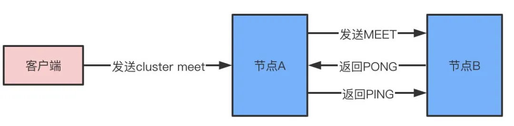
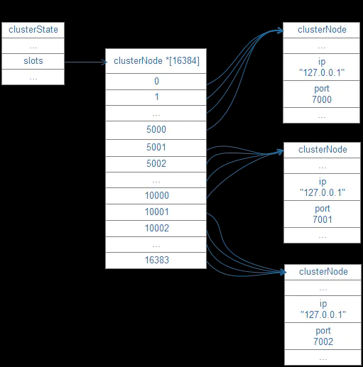

### 缓存雪崩 缓存穿透 缓存击穿
- 缓存雪崩：流量正好进来的时候大部分key失效，导致在服务挂掉。解决方式：
  1. 失效时间加随机值，或者直接不设置过期时间
  2. 限流
- 缓存穿透：缓存和db中都没有数据，用户恶意发起请求，导致db压力过大，服务挂掉。解决方式：
  1. 接口层增加校验，非法请求直接拦截掉
  2. nigix配置，对非法ip直接拦截
  3. db中查不到的key，value直接置为null/返回失败/稍后重试等信息
  4. 布隆过滤器，判断key是否在db中存在，不存在就直接return，存在就查db/写缓存
- 缓存击穿：一个key非常热点，持续高并发访问，当key失效的瞬间，db挂掉。解决：
  1. 永不过期
  2. 加入二级缓存，提前加载热key数据到内存中
  3. 加锁更新，比如请求查询A，发现缓存中没有，去数据库查询数据的时候对A这个key加锁，然后再写入缓存。

### 布隆过滤器
- 添加元素
  - 将要添加的元素给 k 个哈希函数
  - 得到对应于位数组上的 k 个位置
  - 将这k个位置设为 1
- 查询元素
  - 将要查询的元素给k个哈希函数
  - 得到对应于位数组上的k个位置
  - 如果k个位置有一个为 0，则肯定不在集合中
  - 如果k个位置全部为 1，则可能在集合中

### 布隆过滤器使用场景
- 数据库防止穿库。使用BloomFilter来减少不存在的行或列的磁盘查找。避免代价高昂的磁盘查找会大大提高数据库查询操作的性能。
- 业务场景中判断用户是否阅读过某视频或文章，比如抖音或头条，当然会导致一定的误判，但不会让用户看到重复的内容。
- 缓存宕机、缓存穿透场景，只有在布隆过滤器中，才去查询缓存，如果没查询到，则穿透到db。如果不在布隆器中，则直接返回。
  
### redis为啥这么快呢？
redis的速度非常的快，单机的redis就可以支撑每秒10几万的并发，相对于mysql来说，性能是mysql的几十倍。速度快的原因主要有几点：
1. 完全基于内存操作
2. C语言实现，优化过的数据结构，基于几种基础的数据结构，redis做了大量的优化，性能极高
3. 使用单线程，无上下文的切换成本
4. 基于非阻塞的IO多路复用机制

### redis支持的数据类型
String，list，hash，set，zset

### String内部编码
- int：8 个字节的长整型。
- embstr：小于等于 39 个字节的字符串。
- raw：大于 39 个字节的字符串。
会根据当前值的类型和长度决定使用哪种内部编码实现。

### hash
键值本身又是一个键值对结构，value={ {field1，value1}，...{fieldN，valueN} }
#### 内部编码
- ziplist（压缩列表）：当哈希类型元素个数（field） 小于 hash-max-ziplist-entries 配置（默认 512 个）、同时所有值都小于hash-max-ziplist-value配置（默认 64 字节）时，ziplist 使用更加紧凑的结构实现多个元素的连续存储，所以在节省内存方面比 hashtable 更加优秀。
- hashtable（哈希表）：当哈希类型无法满足 ziplist 的条件时，Redis 会使用 hashtable 作为哈希的内部实现，因为此时 ziplist 的读写效率会下降，而 hashtable 的读写时间复杂度为 O(1)。

### list
#### 内部编码
- ziplist：使用条件同上
- linkedlist：无法满足ziplist时使用
#### 使用场景
- lpush + lpop：Stack（栈）
- lpush + rpop：Queue（队列）
- lpush + ltrim：Capped Collection（有限集合）
- lpush + brpop：Message Queue（消息队列）

### set
#### 内部编码
- intset（整数集合）：当集合中的元素都是整数且元素个数小于 set-max-intset-entries 配置（默认 512 个）时，Redis 会选用 intset 来作为集合的内部实现，从而减少内存的使用。
- hashtable（哈希表）：当集合类型无法满足 intset 的条件时，Redis 会使用 hashtable 作为集合的内部实现。
#### 使用场景

### zset
#### 内部编码
- ziplist（压缩列表）：当有序集合的元素个数小于zset-max-ziplist-entries配置（默认128个）
同时每个元素的值小于 zset-max-ziplist-value 配置（默认64个字节）时，Redis会用ziplist来作为有序集合的内部实现，ziplist可以有效减少内存使用。
- skiplist（跳跃表）：当ziplist条件不满足时，有序集合会使用skiplist作为内部实现，因为此时zip的读写效率会下降。
#### 跳跃表主要由以下部分构成
- 表头（head）：负责维护跳跃表的节点指针。
- 跳跃表节点：保存着元素值，以及多个层。
- 层：保存着指向其他元素的指针。高层的指针越过的元素数量大于等于低层的指针，为了提高查找的效率，程序总是从高层先开始访问，然后随着元素值范围的缩小，慢慢降低层次。
- 表尾：全部由 NULL 组成，表示跳跃表的末尾。
#### Redis 对跳表的优化
- 允许重复的 score 值：多个不同的 value 的 score 值可以相同。
- 进行对比操作时，不仅要检查 score 值，还要检查 value ：当 score 值可以重复时，单靠 score 值无法判断一个元素的身份，所以需要连 value 一并检查。
- 每个节点都带有一个高度为 1 层的后退指针，用于从表尾方向向表头方向迭代：当执行 ZREVRANGE 或 ZREVRANGEBYSCORE 这类以逆序处理有序集的命令时，就会用到这个属性。

### redis是怎么实现延时队列的
使用redis的zset相关指令，zadd可以给每个value赋上一个score，那么我们add的时候可以直接用delay之后的时间戳作为value的score，然后定时触发zrangebyscore指令，每次获取最临近的一个value，拿出之后和当前时间进行对比，如果小于当前时间的话就进行处理。
- 相关命令：ZRANGEBYSCORE key -inf +inf limit 0 1
  
这样做有以下好处：
- 结构简单，利用redis的特性能够做到高并发和高可用，而且利用了redis的持久化的持久化，不必再单独实现
- 可以随时修改要delay的时间，只需再次使用zadd即可进行score的覆盖

### Redis的过期键的删除策略
- 定时过期：每个设置过期时间的key都需要创建一个定时器，到过期时间就会立即清除。该策略可以立即清除过期的数据，对内存很友好；但是会占用大量的CPU资源去处理过期的数据，从而影响缓存的响应时间和吞吐量。
- 惰性过期：只有当访问一个key时，才会判断该key是否已过期，过期则清除。该策略可以最大化地节省CPU资源，却对内存非常不友好。极端情况可能出现大量的过期key没有再次被访问，从而不会被清除，占用大量内存。
- 定期过期：每隔一定的时间，会扫描一定数量的数据库的expires字典中一定数量的key，并清除其中已过期的key。该策略是前两者的一个折中方案。通过调整定时扫描的时间间隔和每次扫描的限定耗时，可以在不同情况下使得CPU和内存资源达到最优的平衡效果。(expires字典会保存所有设置了过期时间的key的过期时间数据，其中，key是指向键空间中的某个键的指针，value是该键的毫秒精度的UNIX时间戳表示的过期时间。)

### Redis的内存淘汰策略有哪些
Redis的内存淘汰策略是指在Redis的用于缓存的内存不足时，怎么处理需要新写入且需要申请额外空间的数据。
- 全局的键空间选择性移除方法
  1. noeviction：当内存不足以容纳新写入数据时，新写入操作会报错。
  2. allkeys-lru：当内存不足以容纳新写入数据时，在键空间中，移除最近最少使用的key。（这个是最常用的）
  3. allkeys-random：当内存不足以容纳新写入数据时，在键空间中，随机移除某个key。
- 设置过期时间的键空间选择性移除方法
  1. volatile-lru：当内存不足以容纳新写入数据时，在设置了过期时间的键空间中，移除最近最少使用的key。
  2. volatile-random：当内存不足以容纳新写入数据时，在设置了过期时间的键空间中，随机移除某个key。
  3. volatile-ttl：当内存不足以容纳新写入数据时，在设置了过期时间的键空间中，有更早过期时间的key优先移除。
- LRU 的全称是 Least Recently Used，也就是说我们认为最近使用过的数据应该是是「有用的」，很久都没用过的数据应该是无用的，内存满了就优先删那些很久没用过的数据。
- Redis的内存淘汰策略的选取并不会影响过期的key的处理。内存淘汰策略用于处理内存不足时的需要申请额外空间的数据；过期策略用于处理过期的缓存数据。

### Redis 的持久化机制都有哪些
Redis 提供两种持久化机制： RDB（默认） 和 AOF 机制
- RDB：Redis DataBase，RDB是Redis默认的持久化方式。按照一定的时间将内存的数据以快照的形式保存到硬盘中，对应产生的数据文件为dump.rdb。通过配置文件中的save参数来定义快照的周期。
  - 可以通过SAVE或者BGSAVE来生成RDB文件。
  - SAVE命令会阻塞redis进程，直到RDB文件生成完毕，在进程阻塞期间，redis不能处理任何命令请求。这显然是不合适的。
  - BGSAVE则是会fork出一个子进程，然后由子进程去负责生成RDB文件，父进程还可以继续处理命令请求，不会阻塞进程。
- AOF：Append-only file，是将Redis执行的每次写命令记录到单独的日志文件中，当重启Redis会重新将持久化的日志中文件恢复数据。
当两种方式同时开启时，数据恢复Redis会优先选择AOF恢复。

### redis两种持久化机制各自的特点分别是什么？
- RDB
  1. 只有一个文件 dump.rdb，方便持久化。
  2. 容灾性好，一个文件可以保存到安全的磁盘。
  3. 性能最大化，fork 子进程来完成写操作，让主进程继续处理命令，所以是 IO 最大化。使用单独子进程来进行持久化，主进程不会进行任何 IO 操作，保证了 redis 的高性能
  4. 相对于数据集大时，比 AOF 的启动效率更高。 
- AOF
  1. 数据安全，aof 持久化可以配置 appendfsync 属性，有 always，每进行一次 命令操作就记录到 aof 文件中一次。
  2. 通过 append 模式写文件，即使中途服务器宕机，可以通过 redis-check-aof 工具解决数据一致性问题。
  3. AOF 机制的 rewrite 模式。AOF 文件没被 rewrite 之前（文件过大时会对命令 进行合并重写），可以删除其中的某些命令（比如误操作的 flushall）) 
  4. AOF 文件比 RDB 文件大，且恢复速度慢。
  5. 数据集大的时候，比 rdb 启动效率低。
   
### Redis Sentinel的主要工作流程
- 每个 Sentinel 每隔10秒向master发送info命令，获取master和它下面所有slave的当前信息
- 当发现master有新的slave之后，sentinel和新的slave同样建立两个连接，同时每个10秒发送info命令，更新master信息
- 每个 Sentinel 以每秒钟一次的频率，向它所知的主服务器、从服务器以及其他 Sentinel 实例发送一个 PING 命令。
- 如果一个实例（instance）距离 最后一次有效回复 PING 命令的时间超过 down-after-milliseconds 所指定的值，那么这个实例会被 Sentinel 标记为主观下线。
- 如果一个主服务器被标记为主观下线，那么正在监视这个主服务器的所有 Sentinel 节点，要以每秒一次的频率确认主服务器的确进入了主观下线状态。当有足够数量的Sentinel（至少要达到配置文件指定的数量）在指定的时间范围内同意这一判断，那么这个主服务器被标记为客观下线。
- 当一个主服务器被 Sentinel 标记为客观下线时，Sentinel 向下线主服务器的所有从服务器发送 INFO 命令的频率，会从 10 秒一次改为每秒一次。
- Sentinel 和其他 Sentinel 协商主节点的状态，如果主节点处于 SDOWN 状态，则投票自动选出新的主节点。将剩余的从节点指向新的主节点进行数据复制。
- 当没有足够数量的 Sentinel 同意主服务器下线时， 主服务器的客观下线状态就会被移除。当主服务器重新向 Sentinel 的 PING 命令返回有效回复时，主服务器的主观下线状态就会被移除。
- 注意：一个有效的 PING 回复可以是：+PONG、-LOADING 或者 -MASTERDOWN。如果 服务器 返回除以上三种回复之外的其他回复，又或者在指定时间内没有回复 PING 命令， 那么 Sentinel 认为服务器返回的回复无效（non-valid）。
- sentinel典型配置是一主两从，外加三台redis服务器

### 能说说redis集群的原理吗？
如果说依靠哨兵可以实现redis的高可用，如果还想在支持高并发同时容纳海量的数据，那就需要redis集群。redis集群是redis提供的分布式数据存储方案，集群通过数据分片sharding来进行数据的共享，同时提供复制和故障转移的功能。
#### 节点node
一个redis集群由多个节点node组成，而多个node之间通过cluster meet命令来进行连接，节点的握手过程：
1. 节点A收到客户端的cluster meet命令
2. A根据收到的IP地址和端口号，向B发送一条meet消息
3. 节点B收到meet消息返回pong
4. A知道B收到了meet消息，返回一条ping消息，握手成功
5. 最后，节点A将会通过gossip协议把节点B的信息传播给集群中的其他节点，其他节点也将和B进行握手
  
#### 槽slot
- Redis Cluster中有一个16384长度的槽的概念，他们的编号为0、1、2、3……16382、16383。槽是一个虚拟的概念。正常工作的时候，Redis Cluster中的每个Master节点都会负责一部分的槽，当有某个key被映射到某个Master负责的槽，那么这个Master负责为这个key提供服务
- 哪个Master节点负责哪个槽，这是可以由用户指定的，也可以在初始化的时候自动生成（redis-trib.rb脚本）。
- 在Redis Cluster中，只有Master才拥有槽的所有权，如果是某个Master的slave，这个slave只负责槽的使用，但是没有所有权。
- Master节点用bit来标识对于某个槽自己是否拥有。比如对于编号为1的槽，Master只要判断序列的第二位（索引从0开始）是不是为1即可。时间复杂度为O（1）。
- 数据库中的每个键都属于这16384个哈希槽的其中一个，集群使用公式CRC16(key) % 16384来计算键key属于哪个槽，其中CRC16(key)语句用于计算键key的CRC16校验。
- 集群中的每个node负责处理一部分哈希槽。
  
#### 请求重定向
由于每个节点只负责部分slot，以及slot可能从一个节点迁移到另一节点，造成客户端有可能会向错误的节点发起请求。因此需要有一种机制来对其进行发现和修正，这就是请求重定向。有两种不同的重定向场景：
- MOVED错误：请求的key对应的槽不在该节点上，节点将查看自身内部所保存的哈希槽到节点ID的映射记录，并回复一个MOVED错误。
  
- ASK错误

### 了解Redis事务机制吗？
redis通过MULTI、EXEC、WATCH等命令来实现事务机制，事务执行过程将一系列多个命令按照顺序一次性执行，并且在执行期间，事务不会被中断，也不会去执行客户端的其他请求，直到所有命令执行完毕。事务的执行过程如下：
- 服务端收到客户端请求，事务以MULTI开始
- 如果客户端正处于事务状态，则会把事务放入队列同时返回给客户端QUEUED，反之则直接执行这个命令
- 当收到客户端EXEC命令时，WATCH命令监视整个事务中的key是否有被修改，如果有则返回空回复到客户端表示失败，否则redis会遍历整个事务队列，执行队列中保存的所有命令，最后返回结果给客户端

