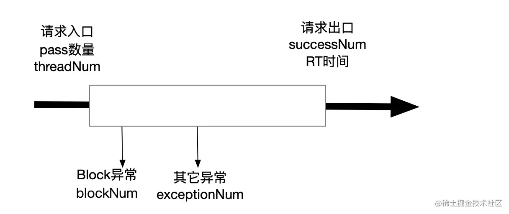

### sentinel 底层原理
Sentinel 底层采用高性能的滑动窗口数据结构 LeapArray 来统计实时的秒级指标数据，对应逻辑在StatisticSlot插槽中
#### 4个关键属性
1. windowLengthInMs 每个窗口有多少毫秒，默认intervalInMs/sampleCount也就是1000ms
2. sampleCount 窗口数量，默认60
3. intervalInMs 要统计的间隔时长，默认60*1000也就是1分钟
4. array 即统计的数据存放的地方
#### 获取当前窗口
1. 根据当前时间计算出在窗口下标idx以及开始时间windowStart
2. 根据idx获取到oldBucket
3. oldBucket为null，创建新的bucket，通过cas的方式set到对应窗口
4. oldBucket不为null的情况下，判断windowStart和oldBucket.windowStart的大小
5. 如果相等，返回oldBucket，如果大于，则oldBucket.windowStart=windowStart，oldBucket中的统计信息reset
6. 一般不存在小于的情况，兜底处理是返回新的bucket
```java
private int calculateTimeIdx(/*@Valid*/ long timeMillis) {
    long timeId = timeMillis / windowLengthInMs;
    // Calculate current index so we can map the timestamp to the leap array.
    return (int)(timeId % array.length());
}

protected long calculateWindowStart(/*@Valid*/ long timeMillis) {
    return timeMillis - timeMillis % windowLengthInMs;
}

public WindowWrap<T> currentWindow(long timeMillis) {
    if (timeMillis < 0) {
        return null;
    }

    int idx = calculateTimeIdx(timeMillis);
    // Calculate current bucket start time.
    long windowStart = calculateWindowStart(timeMillis);

    /*
     * Get bucket item at given time from the array.
     *
     * (1) Bucket is absent, then just create a new bucket and CAS update to circular array.
     * (2) Bucket is up-to-date, then just return the bucket.
     * (3) Bucket is deprecated, then reset current bucket and clean all deprecated buckets.
     */
    while (true) {
        WindowWrap<T> old = array.get(idx);
        if (old == null) {
            /*
             *     B0       B1      B2    NULL      B4
             * ||_______|_______|_______|_______|_______||___
             * 200     400     600     800     1000    1200  timestamp
             *                             ^
             *                          time=888
             *            bucket is empty, so create new and update
             *
             * If the old bucket is absent, then we create a new bucket at {@code windowStart},
             * then try to update circular array via a CAS operation. Only one thread can
             * succeed to update, while other threads yield its time slice.
             */
            WindowWrap<T> window = new WindowWrap<T>(windowLengthInMs, windowStart, newEmptyBucket(timeMillis));
            if (array.compareAndSet(idx, null, window)) {
                // Successfully updated, return the created bucket.
                return window;
            } else {
                // Contention failed, the thread will yield its time slice to wait for bucket available.
                Thread.yield();
            }
        } else if (windowStart == old.windowStart()) {
            /*
             *     B0       B1      B2     B3      B4
             * ||_______|_______|_______|_______|_______||___
             * 200     400     600     800     1000    1200  timestamp
             *                             ^
             *                          time=888
             *            startTime of Bucket 3: 800, so it's up-to-date
             *
             * If current {@code windowStart} is equal to the start timestamp of old bucket,
             * that means the time is within the bucket, so directly return the bucket.
             */
            return old;
        } else if (windowStart > old.windowStart()) {
            /*
             *   (old)
             *             B0       B1      B2    NULL      B4
             * |_______||_______|_______|_______|_______|_______||___
             * ...    1200     1400    1600    1800    2000    2200  timestamp
             *                              ^
             *                           time=1676
             *          startTime of Bucket 2: 400, deprecated, should be reset
             *
             * If the start timestamp of old bucket is behind provided time, that means
             * the bucket is deprecated. We have to reset the bucket to current {@code windowStart}.
             * Note that the reset and clean-up operations are hard to be atomic,
             * so we need a update lock to guarantee the correctness of bucket update.
             *
             * The update lock is conditional (tiny scope) and will take effect only when
             * bucket is deprecated, so in most cases it won't lead to performance loss.
             */
            if (updateLock.tryLock()) {
                try {
                    // Successfully get the update lock, now we reset the bucket.
                    return resetWindowTo(old, windowStart);
                } finally {
                    updateLock.unlock();
                }
            } else {
                // Contention failed, the thread will yield its time slice to wait for bucket available.
                Thread.yield();
            }
        } else if (windowStart < old.windowStart()) {
            // Should not go through here, as the provided time is already behind.
            return new WindowWrap<T>(windowLengthInMs, windowStart, newEmptyBucket(timeMillis));
        }
    }
}
```
#### 窗口中的数据存储结构用的是MetricBucket。其统计了6个维度的数据
```java
public enum MetricEvent {

    /**
     * Normal pass.
     */
    PASS,
    /**
     * Normal block.
     */
    BLOCK,
    EXCEPTION,
    SUCCESS,
    RT,

    /**
     * Passed in future quota (pre-occupied, since 1.5.0).
     */
    OCCUPIED_PASS
}
```
#### 统计时机
我们知道数据统计入口在StatisticSlot中，那么以上指标分别在什么时候统计的呢？大致如下：
- 在entry时增加TheadNum, Pass，如果遇到异常则增加BlockQPS，遇到特殊异常会增加Exception数量
- 在exit时统计SUCCESS和RT
  