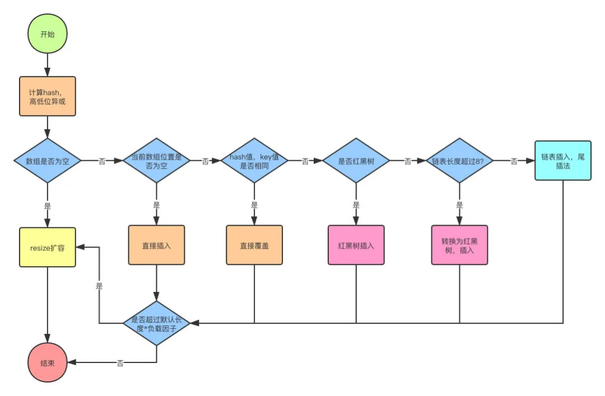
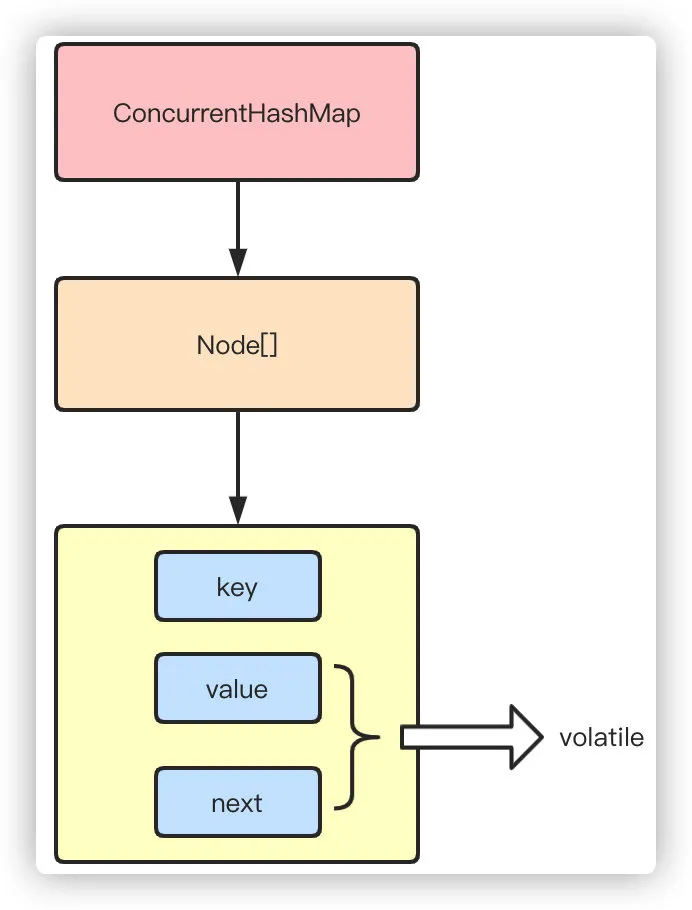
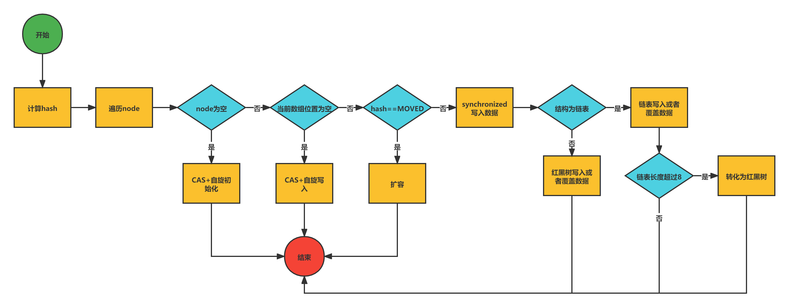

## 基础类相关

### 面向对象的三大特性
- 封装，将事物的共同属性和方法抽象出来，封装到一个类中，使用时只需要关注类内方法的功能，不需要关注具体的底层实现方法
- 继承，一个类能够继承其它的类，进而使用父类的部分成员和方法，除此之外子类也有自己独有的方法和属性，子类也可以重写父类的方法
- 多态，实例所指向的具体类和引用的实例的方法在编程时并不确定，要到运行时才能确定

### 访问修饰符号
- private：完全私有，只有类内成员能用
- default：类内和同包内可见
- protect：自己和子类能够使用
- public：任何人能够使用
private和protect不能修饰类

### final、finalize、finally的区别
- final修饰的变量不能更改，修饰的方法不能重写，修饰的类不能继承
- finalize：垃圾回收时调用的方法
- finally和try catch结构一起出现，finally块中的代码一定会执行，一般放一些关闭资源的逻辑
   
### static关键词
- 在没有创建实例的时候也能使用类内的属性和方法
- static的属性和方法不属于某个实例，而是属于类所有的实例所共有
- static修饰的部分，会在类第一次加载的时候进行加载
- static主要用于的场景：创建实例消耗资源较大，且只需要创建一次就能完成目标的任务

### 匿名内部类
- 必须实现一个接口或者继承一个类，而且不能是抽象的
- 内部不能定义静态成员和方法
- 所在方法的形参需要被匿名内部类使用时，需要定义为final，因为如果不定义为final，就会在方法结束时销毁，内部类对变量的应用依然存在，就会导致调用时出错

### 对象头具体都包含哪些内容
- 对象自身运行时所需的数据，也被称为Mark Word，也就是用于轻量级锁和偏向锁的关键点。具体的内容包含对象的hashcode、分代年龄、轻量级锁指针、重量级锁指针、GC标记、偏向锁线程ID、偏向锁时间戳。
- 存储类型指针，也就是指向类的元数据的指针，通过这个指针才能确定对象是属于哪个类的实例。

### ==和equals的区别
- 对于基础数据类型，==是比较变量的值，对于引用数据类型来说，==是比较内存地址
- equals未重写时比较内存地址，可以重写成比较实例的值是否相等。要注意的是String的equals方法被重写过
   
### hashCode和equals
重写equals必须重写hashCode
举例说明：hashSet放入数据的时候，会根据对象的hashcode值来计算放的位置，同时会与其它已经在集合中的对象的hashcode相比较，如果没有重复的，会直接插入，但是有重复的hashcode，就会再比较对象的内容是否相等，这样的话可以减少equals次数，大大提高执行速度

### new一个对象的过程
1. 当虚拟机遇见new关键字时候，实现判断当前类是否已经加载，如果类没有加载，首先执行类的加载机制
2. 为对象分配合适大小的内存空间
3. 为实例变量赋默认值
4. 设置对象的头信息，对象hash码、GC分代年龄、元数据信息等
5. 执行构造函数(init)初始化

### 双亲委派模型
类加载器自顶向下分为：
1. Bootstrap ClassLoader启动类加载器：默认会去加载JAVA_HOME/lib目录下的jar
2. Extention ClassLoader扩展类加载器：默认去加载JAVA_HOME/lib/ext目录下的jar
3. Application ClassLoader应用程序类加载器：比如我们的web应用，会加载web程序中ClassPath下的类
4. User ClassLoader用户自定义类加载器：由用户自己定义
   
当我们在加载类的时候，首先都会向上询问自己的父加载器是否已经加载，如果没有则依次向上询问，如果没有加载，则从上到下依次尝试是否能加载当前类，直到加载成功。
  
### I/O 多路复用select、poll、epoll之间的区别
|            | select             | poll             | epoll                                             |
| ---------- | ------------------ | ---------------- | ------------------------------------------------- |
| 数据结构   | bitmap             | 数组             | 红黑树                                            |
| 最大连接数 | 1024               | 无上限           | 无上限                                            |
| fd拷贝     | 每次调用select拷贝 | 每次调用poll拷贝 | fd首次调用epoll_ctl拷贝，每次调用epoll_wait不拷贝 |
| 工作效率   | 轮询 O(n)          | 轮询 O(n)        | 回调 O(1)                                         |

### 反射
在运行状态中，对于任意一个类，我们能够知道其任意方法和属性。
优点：能够动态加载类，提高灵活度。缺点：反射相当于一系列解释操作，性能较差

### 获取反射的三种方法
- new 对象： Student stu = new Student(); Class s = stu.getClass();
- 路径，Class.forName: Class s = Class.forName("xxx.Student");
- 类名: Class s = Student.class;
   
### String的特点
- 不变性，immutable对象，被多个线程共享并频繁访问时，可以保证一致性
- 常量池优化，常量池位于方法区中
- 被final修饰，不能被继承，保证了安全性

### StringBuilder和StringBuffer
两个都继承自AbstractStringBuilder，StringBuffer加了同步锁，是线程安全的，但性能较差

## 集合 

### 集合和数组的区别
- 集合是可变长度的，数组是定长的
- 数组能够存基本和引用数据类型，集合只能存引用数据类型
- 数组存储的元素必须是同一数据类型，集合存储的可以是不同数据类型

### 数组和list的互转
- 数组转list：Arrays.asList(arrays)
- list转数组：list.toArray()

### ArrayList和LinkedList的区别
- ArrayList底层是数组实现的，LinkedList是双向链表实现的
- ArrayList实现了RandomAccess接口，查找元素较快，LinkedList因为是线性数据存储方式，所以随机查找元素较慢
- ArrayList插入和删除元素因为有复制的动作，所以比LinkedList慢
- LinkedList比ArrayList更占内存，因为需要存储两个引用，一个指向前一个元素，一个指向后一个
- 两个都不是线程安全的

### ArrayList如何保证多线程下的线程安全
可以使用Collections.synchronizedList方法，转换成线程安全容器后再使用，或者使用HashTable

### Queue中的poll()和remove()方法
它们都是返回第一个元素，并删除，但是用poll()，队列为空时会返回null，而remove()会直接报错

### HashMap的运行原理
- put数据时，首先通过对key hash然后与数组长度-1进行与运算((n-1)&hash)，都是2的次幂所以等同于取模，但是位运算的效率更高
- 如果出现了相同hashcode的key，就会再次判断key值是否相等
- key值相等，则覆盖原始值，如果key不同，则将key-value插入到链表的尾部
- 链表的长度超过8，则会转换成红黑树，查询效率由O(n) -> O(logn)
- 最后判断数组长度是否超过默认的长度\*负载因子（16\*0.75=12），超过则进行扩容。
- 获取数据时，首先根据hashcode找到在数组中的下标，再比较key，找到对应值
  

### ConcurrentHashmap了解过吗
ConcurrentHashmap在JDK1.7和1.8的版本改动比较大，1.7使用Segment+HashEntry分段锁的方式实现，1.8则抛弃了Segment，改为使用CAS+synchronized+Node实现，同样也加入了红黑树，避免链表过长导致性能的问题。
着重说下1.8之后的：
- 抛弃分段锁，转为用CAS+synchronized来实现
- HashEntry改为Node
  
put流程
- 首先计算hash，遍历Node数组，如果Node数组为空，调用initTable进行初始化，内部是通过CAS+自旋的方式进行
- 如果当前Node数组位置是空则直接通过CAS+自旋自旋写入数据
- 如果hash==MOVED，说明需要扩容，调用helpTransfer执行扩容
- 如果onlyIfAbsent=true，那么用非加锁的方式判断Node头上的value是否满足，满足则返回
- 如果以上都不满足，就使用synchronized写入数据，写入数据同样判断链表、红黑树，链表写入和HashMap的方式一样，key hash一样就覆盖，反之就尾插法，链表长度超过8就转换成红黑树
- 如果添加成功就调用addCount()方法统计size，并且检查是否需要扩容
  

## 异常

### 受检异常和非受检异常
- 受检异常为除RuntimeException之外的其它Exception
- 非受检异常为Error和RuntimeException及其子类

### catch中有return，finally还会执行吗
会在return前执行，而且如果finally中也有return，会覆盖catch中的return

## jvm相关

### 内存区包括哪几部分
- 方法区，用于存储类结构信息的地方，包括常量池、静态变量、构造函数等
- java堆，线程共享，用来存储实例，是GC的主要区域
- java栈，每个线程对应一个栈，每运行一个方法就创建一个栈帧。每一个方法从调用直至返回，就对应的是栈帧在java栈中入栈到出栈的过程。jva栈是线程私有的
- 程序计数器，也是线程私有的，记录当前线程下虚拟机正在执行的字节码的指令地址
- 本地方法栈：主要用于执行本地native方法的区域

### 垃圾回收算法
- 标记 - 清除，缺点是会产生大量碎片
- 复制，缺点是需要2倍空间
- 标记 - 整理
- 分代收集，将对象按照生命周期的不同划分成：年轻代、年老代、持久代。其中持久代主要放类信息，和GC的关系不大

### 能做root的都有什么
- 虚拟机栈（栈帧中的本地变量表）中引用的对象；即方法运行时，方法中引用的对象
- 方法区中类静态属性引用的对象；即类的静态变量引用的对象
- 方法区中常量引用的对象；即类中常量引用的对象
- 本地方法栈中JNI（即一般说的Native方法）引用的对象；

### 简单描述垃圾收集过程
当对象创建的时候，垃圾回收器就会监控对象的地址、大小和使用情况，当满足2个条件（引用计数器归零，不可达）之一，就会触发垃圾回收，此时对象属于属于年轻代，eden区，eden区满了之后就会执行一次minor GC，存活下来的进入Survivor中的From，From中也会进行minor GC，存活下来的会进入To，From到To穿梭一次，年龄会+1，当年龄到15之后会进入年老代，年老代每隔一段时间会执行一次full GC/major GC

### 常用垃圾回收器
#### Serial收集器
Serial（串行）收集器是最基本、历史最悠久的垃圾收集器了，通过名称就可以看出该垃圾收集器是一个单线程收集器。它的单线程的意义不仅仅意味着它只会使用一条垃圾收集线程去完成垃圾收集工作，更重要的是它在进行垃圾收集工作时候必须暂停其它所有的线程（Stop the world）， 直到它收集结束。

#### ParNew收集器
ParNew收集器其实就是Serial的多线程版本，除了使用多线程进行垃圾收集之外，其余行为（控制参数、收集算法、回收策略等）和Serial收集器完全一样。

#### Parallel Scavenge收集器
Parallel Scavenge收集器关注是吞吐量（高效的复用cpu）， CMS关注的点更多的是用户线程的停顿时间（提高用户体验）

#### CMS收集器
CMS（Concurrent Mark Sweep）收集器是一种以获取最短回收停顿时间为目标的收集器，它是Hotspot虚拟机第一款真正意义上的并发收集器，第一次实现了：一定程度上让垃圾收集线程与用户线程同时工作

#### G1收集器
- 堆内存会被切分成为很多个固定大小区域（Region），每个Region是连续范围的虚拟内存。
- 堆内存中一个区域(Region)的大小可以通过-XX:G1HeapRegionSize参数指定，大小区间最小1M、最大32M，2的幂次方。
- 默认把堆内存按照2048份均分。
- 每个Region被标记了E、S、O和H，这些区域在逻辑上被映射为Eden，Survivor和老年代。
- 存活的对象从一个区域转移（即复制或移动）到另一个区域。区域被设计为并行收集垃圾，可能会暂停所有应用线程。
- 此外，还有第四种类型，被称为巨型区域（Humongous Region）。H区是为了那些存储超过50%标准region大小的对象而设计的，如果一个H区装不下一个巨型对象，那么G1会寻找连续的H分区来存储。为了能找到连续的H区，有时候不得不启动Full GC。  
- 回收步骤：  
  - 初始标记 Initial Marking：这个阶段是STW(Stop the World )的，所有应用线程会被暂停，标记出从GC Root开始直接可达的对象。
  - 并发标记：从GC Roots开始对堆中对象进行可达性分析，找出存活对象，耗时较长。当并发标记完成后，开始最终标记(Final Marking )阶段
  - 最终标记：标记那些在并发标记阶段发生变化的对象，方便后续回收
  - 筛选回收：首先对各个Region的回收价值和成本进行排序，根据用户所期待的GC停顿时间指定回收计划，回收一部分Region

G1中提供了两种模式垃圾回收模式，Young GC和Mixed GC，两种都是Stop The World(STW)的。
- YoungGC：在分配一般对象（非巨型对象）时，当所有eden region使用达到最大阀值并且无法申请足够内存时，会触发一次YoungGC。每次younggc会回收所有Eden以及Survivor区，并且将存活对象复制到Old区以及另一部分的Survivor区，此处应该是按照年龄进行复制的。
- mixedGC：当越来越多的对象晋升到老年代old region时，为了避免堆内存被耗尽，虚拟机会触发一个混合的垃圾收集器，即mixed gc，除了回收整个young region，还会回收一部分的old region，可以选择哪些old region进行收集，从而可以对垃圾回收的耗时时间进行控制。

### 比较CMS和G1垃圾回收器区别
- 作用区域:CMS是老年代回收器，G1是年轻代和老年代 
- 回收算法:CMS是标记清除，G1是标记整理 
- G1对内存空间划分为Region, CMS为新生代、老年代
- G1可预测停顿时间，两者都是并行回收

## 其它

### 雪花算法