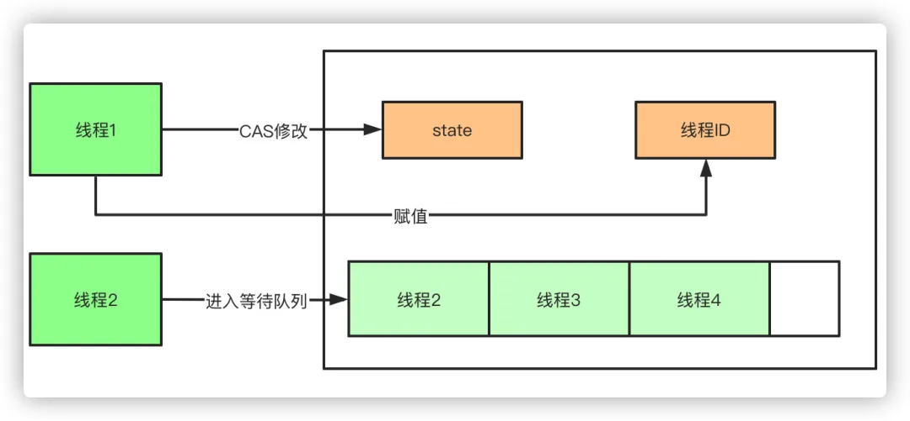
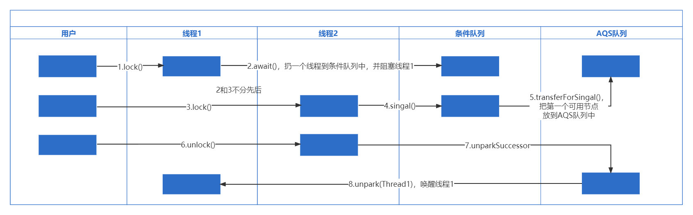
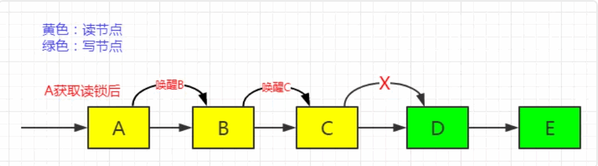

### 为什么要使用并发编程
- 提高CPU的使用效率，充分利用多核CPU的计算能力，提高程序的执行效率
- 方便进行业务拆分，系统的高并发能力一般都是通过并发编程实现的

### 进程与线程的区别
- 根本区别：进程是操作系统资源分配的基本单位，而线程是处理器任务调度和执行的基本单位
- 资源开销：每个进程都有独立的代码和数据空间（程序上下文），进程之间的切换会有较大的开销，线程共享代码和数据空间，每个线程都有自己独立的运行栈和程序计数器（PC），线程之间切换的开销小。
- 包含关系：如果一个进程内有多个线程，则执行过程不是一条线的，而是多条线（线程）共同完成的线程是进程的一部分，所以线程也被称为轻权进程或者轻量级进程。
- 内存分配：同一进程的线程共享本进程的地址空间和资源，而进程之间的地址空间和资源是相互独立的
- 影响关系：一个进程崩溃后，在保护模式下不会对其他进程产生影响，但是一个线程崩溃整个线程都死掉。所以多进程要比多线程健壮。
- 执行过程：每个独立的进程有程序运行的入口、顺序执行序列和程序出口。但是线程不能独立执行，必须依存在应用程序中，由应用程序提供多个线程执行控制，两者均可并发执行

### 并发编程三要素
- 原子性，一个动作要么全部执行成功，要么全部失败
- 可见性，一个线程对变量的修改，另一个线程能够看到
- 有序性，能够按照代码的先后顺序进行执行

### CAS的原理
CAS叫做CompareAndSwap，比较并交换，主要是通过处理器的指令来保证操作的原子性，它包含三个操作数：
1. 变量内存地址，V表示
2. 旧的预期值，A表示
3. 准备设置的新值，B表示
- 当执行CAS指令时，只有当V等于A时，才会用B去更新V的值，否则就不会执行更新操作。
#### CAS有什么缺点
- ABA问题：ABA的问题指的是在CAS更新的过程中，当读取到的值是A，然后准备赋值的时候仍然是A，但是实际上有可能A的值被改成了B，然后又被改回了A，这个CAS更新的漏洞就叫做ABA。只是ABA的问题大部分场景下都不影响并发的最终效果。
- ABA如何解决：Java中有AtomicStampedReference来解决这个问题，他加入了预期标志和更新后标志两个字段，更新时不光检查值，还要检查当前的标志是否等于预期标志，全部相等的话才会更新。
- 循环时间长开销大：自旋CAS的方式如果长时间不成功，会给CPU带来很大的开销。
- 只能保证一个共享变量的原子操作，多个则不行，多个可以通过AtomicReference来处理或者使用锁synchronized实现。

### volatile相关
volatile能够解决可见性和有序性问题
#### 可见性
可见性是指当一个线程修改了共享变量的值，其它线程能立即感知到这种变化，而普通变量无法做到立即感知这一点，变量的值在线程之间的传递均需要通过主内存来完成，比如，线程A修改了一个普通变量的值，然后向主内存回写，另外一条线程B只有在线程A的回写完成之后再从主内存中读取变量的值，才能够读取到新变量的值，也就是新变量才能对线程B可见。在这期间可能会出现不一致的情况，比如：
- 线程A并不是修改完成后立即回写
- 线程B还在用着自己工作内存中的值，而并不是立即从主内存读取值
java内存模型规定，volatile变量的每次修改都必须立即回写到主内存中，volatile变量的每次使用都必须从主内存刷新最新的值。所以可以保证可见性
#### 有序性
有序性可以概括为一句话：如果在本线程中观察，所有的操作都是有序的，如果在另一个线程中观察，所有的操作都是无序的。而volatile变量是禁止重排序的，它能保证多线程下程序实际运行是按代码顺序执行的。
#### volatile实现原理
答案是内存屏障，内存屏障有两个作用：
1. 阻止屏障两侧的指令重排序
2. 强制把写缓冲区/高速缓存中的数据回写到主内存，让缓存中相应的数据失效
#### 缺点：不能实现原子性

### synchronized
#### 监视器作用
每个对象都与监视器相关联，一旦方法或者代码块被 synchronized 修饰，那么被修饰的部分就进入监视器的监视区域，监视器能够保证一次只有一个线程执行被修饰的代码
#### synchronized关键词的三种使用场景
- 修饰实例方法，用于给当前实例加锁
- 修饰静态方法，因为静态方法时类的所有实例所共有，所以修饰静态方法就相当于给类加锁
- 修饰代码块，对给定对象加锁，进入同步代码块前要获得给定对象的锁
#### synchronized四种状态：无锁状态、偏向锁状态、轻量级锁状态、重量级锁状态
#### 为什么要引入偏向锁
因为经过HotSpot的作者大量的研究发现，大多数时候是不存在锁竞争的，常常是一个线程多次获得同一个锁，因此如果每次都要竞争资源会付出很多没有必要的代价，为了降低获取锁的代价，才引入的偏向锁。
#### 偏向锁的升级
线程1获取锁对象时，会在java对象头和栈帧中记录线程的threadID，当有其它线程尝试再次获取锁对象的时候，需要比较此线程的threadID和对象头中记录的threadID是否一致：
- 如果一致，说明还是线程1获取对象，那就无需再次加锁
- 如果不一致，继续检查线程1是否存活
- 如果存活，再去看线程1的栈帧信息，观察线程1是否还持有对象，还持有的话会升级成轻量级锁
- 如果线程1未存活，或者线程1已经不持有对象了，那么就会将对象偏向新的线程
#### 偏向锁的开启和取消
- 偏向锁默认开启，而且开始时间比应用程序启动慢几秒，如果不想有延迟：-XX:BiasedLockingStartUpDelay=0
- 如果不想要偏向锁：-XX:-UseBiasedLocking=false
#### 为什么要引入轻量级锁
轻量级锁考虑的是竞争对象的线程不多，而且线程持有锁的时间也不长的情景。因为阻塞线程需要CPU从用户态转到内核态，代价较大，如果刚刚阻塞不久这个锁就被释放了，那这个代价就有点得不偿失了，因此这个时候就干脆不阻塞竞争资源的线程，让它自旋着等待锁释放。
#### 轻量级锁如何升级为重量级锁
1. 线程1获取轻量级锁时会先把锁对象的对象头Mark Word复制一份到线程1栈帧中的DisplacedMarkWord空间（用于存储锁记录的空间），然后使用CAS使对象头中的轻量级锁指针指向DisplacedMarkWord的地址
2. 如果在线程1复制对象头的同时（在线程1CAS之前），线程2也准备获取锁，复制了对象头到线程2的DisplacedMarkWord空间中，但是在线程2CAS的时候，发现对象的轻量级锁指针已经指向线程1的DisplacedMarkWord地址，线程2的CAS失败，那么线程2就使用自旋的方式不断尝试CAS。
3. 但是如果自旋的时间太长也不行，因为自旋是要消耗CPU的，因此自旋的次数是有限制的，如果自旋次数到了线程1还没有释放锁，或者线程1还在执行，线程2还在自旋等待，这时又有一个线程3过来竞争锁对象，那么轻量级锁就会升级为重量级锁。
4. 重量级锁把除了拥有锁的线程都阻塞，防止CPU空转。
#### synchronized原理
- 使用synchronized之后，会在编译之后在同步的代码块前后加上monitorenter和monitorexit字节码指令，他依赖操作系统底层互斥锁实现。他的作用主要就是实现原子性操作和解决共享变量的内存可见性问题。
- 执行monitorenter指令时会尝试获取对象锁，如果对象没有被锁定或者已经获得了锁，锁的计数器+1。此时其他竞争锁的线程则会进入等待队列中。
- 执行monitorexit指令时则会把计数器-1，当计数器值为0时，则锁释放，处于等待队列中的线程再继续竞争锁。

### Lock体系&AQS
#### Lock 接口(Lock interface)是什么？对比同步它有什么优势？
Lock 接口比同步方法和同步块提供了更具扩展性的锁操作。他们允许更灵活的结构，可以具有完全不同的性质，并且可以支持多个相关类的条件对象。它的优势有：
1. 构造函数参数fair = true，可以手动创建公平锁
2. lockInterruptibly，它与lock()方法的主要区别在于获取锁的时候如果线程中断，会抛出一个异常，而lock()不会管线程是否中断都会一直尝试获取锁，获取锁之后把自己标记为已中断，继续执行自己的逻辑，后面也会正常释放锁。线程中断是在线程上打一个中断标志，并不会对运行中的线程有什么影响，具体需要根据这个中断标志干些什么，用户自己去决定。
3. tryLock，可以让线程尝试获取锁，并在无法获取锁的时候立即返回或者等待一段时间，
4. Condition，其作用是：对于一个锁，我们可以为线程间建立多个不同的Condition。通过Condition能够更加精细的控制多线程的休眠与唤醒，可以在不同的范围，以不同的顺序获取和释放锁。
   ```java
   private final Lock lock = new ReentrantLock();
   private Condition full = lock.newCondition();
   private Condition empty = lock.newCondition();
   ```
   然后两个condition就可以使用await/signal分别控制不同的动作了，比如ArrayBolckingQueue中的put和take这两个动作比wait/notify那种灵活
#### AQS主要结构
- AQS是Java中几乎所有锁和同步器的一个基础框架
- AQS中维护了一个状态变量state，用来控制加锁解锁
- AQS中维护了一个队列，由双向链表实现，用来放置等待的线程及线程状态等信息，有head和tail属性

### 可重入锁ReentrantLock
#### 公平锁
公平性是针对获取锁而言的，如果一个锁是公平锁，那么锁的获取顺序就应该符合请求上的绝对时间顺序
#### 可重入锁：指一个线程获取锁之后再尝试获取锁时会自动获取锁
比如一个线程获得了某个对象的锁，此时这个对象锁还没有释放，当其再次想要获取这个对象的锁的时候还是可以获取的，如果不可锁重入的话，就会造成死锁。同一个线程每次获取锁，锁的计数器都自增1，所以要等到锁的计数器下降为0时才能释放锁。
#### ReentrantLock原理
- 基于AQS(AbstractQueuedSynchronizer 抽象队列同步器)实现
- AQS内部维护一个state状态位，尝试加锁的时候通过CAS(CompareAndSwap)修改值，如果成功设置为1，并且把当前线程ID赋值，则代表加锁成功
- 一旦获取到锁，其他的线程将会被阻塞进入阻塞队列自旋，获得锁的线程释放锁的时候将会唤醒阻塞队列中的线程，释放锁的时候则会把state重新置为0，同时当前线程ID置为空。
  


公平锁：
1. 尝试获取锁，如果获取到了就直接返回了
2. 尝试获取锁失败，再调用addWaiter()构建新节点并把新节点入队
3. 然后调用acquireQueued()再次尝试获取锁，如果成功了，直接返回
4. 如果再次失败，再调用shouldParkAfterFailedAcquire()将节点的等待状态置为等待唤醒（SIGNAL）
5. 调用parkAndCheckInterrupt()阻塞当前线程
6. 如果被唤醒了，会继续在acquireQueued()的for()循环再次尝试获取锁，如果成功了就返回
7. 如果不成功，再次阻塞，重复3、4、5直到成功获取到锁
   
非公平锁有两点不同：
1. 一开始就尝试CAS更新状态变量state的值，如果成功了就获取到锁了
2. 在tryAcquire()的时候没有检查是否前面有排队的线程，直接上去获取锁，不管别人有没有排队
   
释放锁：
1. 将state的值减1
2. 如果state减到了0，说明已经完全释放锁了，唤醒下一个等待着的节点
#### Condition流程
condition.await()方法，表明现在要等待条件的出现
1. 新建一个节点加入到条件队列中去
2. 完全释放当前线程占有的锁，阻塞当前线程，等待条件出现
4. 条件出现后（此时节点已经移到AQS的队列中），尝试获取锁
- 也就是说await()方法内部其实是：先释放锁->等待条件->再次获取锁
  
condition.signal()方法，用来通知条件已经出现
1. 从条件队列的头节点开始寻找一个非取消状态的节点
2. 把它从条件队列移到AQS队列
3. 每次只移动一个节点
- 注意，这里调用signal()方法后并不会真正唤醒一个节点，那么，唤醒一个节点是在啥时候呢？答案是unlock


### 读写锁ReentrantReadWriteLock
因为读数据的时候不会对数据产生影响，所以大部分场景下没必要加锁，因此就有了读写锁，能够实现读写分离，读锁是共享的，写锁是独占的。读和写是互斥的。
#### 读锁获取
1. 先尝试获取读锁，如果成功了直接结束
2. 如果失败了，进入doAcquireShared()方法
3. doAcquireShared()方法中首先会生成一个新节点并进入AQS队列中
4. 如果头节点正好是当前节点的上一个节点，再次尝试获取锁
5. 如果成功了，则设置头节点为新节点，并传播（如果下一个节点是读节点的话，直接唤醒）
6. 如果头节点不是当前节点的上一个节点或者获取锁失败，则阻塞当前线程等待被唤醒，唤醒之后继续走4的逻辑
- doAcquireShared()方法中，节点是依次唤醒，而不是一个节点获取了读锁后一次性唤醒后面所有的读节点
   
#### 读锁释放
1. 将当前线程重入的次数减1
2. 将读锁总共被获取的次数减1
3. 如果读锁获取的次数减为0了，说明完全释放了，那就唤醒下一个节点
- 如下图，ABC三个节点各获取了一次读锁，三者释放的顺序分别为ACB，那么最后B释放的时候tryReleaseShared()才会返回true，进而才会唤醒下一个节点D。

#### 写锁获取
1. 尝试获取锁，如果有读者占有着读锁，尝试获取写锁失败
2. 如果有其它线程占有着写锁，尝试获取写锁失败
3. 如果是当前线程占有着写锁，尝试获取写锁成功，state值加1
4. 如果没有线程占有着锁（state==0），当前线程尝试更新state的值，成功了表示尝试获取锁成功，否则失败
5. 尝试获取锁失败以后，进入队列排队，等待被唤醒
#### 写锁释放
1. 先尝试释放锁，即状态变量state的值减1；
2. 如果减为0了，说明完全释放了锁；
3. 完全释放了锁才唤醒下一个等待的节点；
#### 总结
1. ReentrantReadWriteLock采用读写两把锁，能提高并发的吞吐量；
2. 读锁使用的是共享锁，多个读锁可以一起获取锁，互相不会影响，即读读不互斥；
3. 读写、写读和写写是会互斥的，前者占有着锁，后者需要进入AQS队列中排队；
4. 多个连续的读线程是一个接着一个被唤醒的，而不是一次性唤醒所有读线程；
5. 只有多个读锁都完全释放了才会唤醒下一个写线程；
6. 只有写锁完全释放了才会唤醒下一个等待者，这个等待者有可能是读线程，也可能是写线程；
#### 先读后写 & 先写后读
- 先读后写，一个线程占有读锁后，其它线程还是可以占有读锁的，但是其它线程包括它自己都不能再获取写锁。因为这时候如果在其它线程占有读锁之前让自己占有了写锁，其它线程又不能占有读锁了，这段程序会非常难实现，逻辑也很奇怪。
- 先写后读，一个线程占有写锁后，其它线程是不能占有任何锁的，这时候，即使自己占有一个读锁，对程序的逻辑也不会有任何影响，所以，一个线程占有写锁后是可以再占有读锁的，只是这个时候其它线程依然无法获取读锁。
- 一个线程先占有读锁后占有写锁，会有一个很大的问题：锁无法被释放也无法被获取了。这个线程先占有了读锁，然后自己再占有写锁的时候会阻塞，然后它就自己把自己搞死了，进而把其它线程也搞死了，它无法释放锁，其它线程也无法获得锁了。
### 信号量Semaphore
Semaphore，信号量，它保存了一系列的许可（permits），每次调用acquire()都将消耗一个许可，每次调用release()都将归还一个许可。通常用于限制同一时间对共享资源的访问次数上，也就是常说的限流。
#### 主要特性
1. Semaphore的内部实现是基于AQS的共享锁来实现的；
2. Semaphore初始化的时候需要指定许可的次数，许可的次数是存储在state中；
3. 获取一个许可时，则state值减1
4. 释放一个许可时，则state值加1
5. 可以动态减少/增加n个许可
#### 如何动态增加n个许可？
调用release(int permits)即可。因为Semaphore与ReentrantLock的释放锁还是有点区别的，Semaphore释放许可的时候并不会检查当前线程有没有获取过许可，所以可以调用释放许可的方法动态增加一些许可。   
#### 如何实现限流？
```java
public static final Semaphore SEMAPHORE = new Semaphore(100);
public static final AtomicInteger failCount = new AtomicInteger(0);
public static final AtomicInteger successCount = new AtomicInteger(0);

public static boolean seckill() {
    if (!SEMAPHORE.tryAcquire()) {
        System.out.println("no permits, count="+failCount.incrementAndGet());
        return false;
    }

    try {
        // 处理业务逻辑
        System.out.println("seckill success, count="+successCount.incrementAndGet());
    } catch (InterruptedException ignore) {} 
    finally {
        SEMAPHORE.release();
    }
    return true;
}
```
### CountDownLatch
允许一个或多个线程等待其它线程的操作执行完毕后再执行后续的操作，通常用法和Thread.join()有点类似，等待其它线程都完成后再执行主任务。
#### 主要特点
1. CountDownLatch使用AQS的共享锁机制实现；
2. CountDownLatch初始化的时候需要传入次数count；
3. 每次调用countDown()方法count的次数减1；
4. 每次调用await()方法的时候会尝试获取锁，这里的获取锁其实是检查AQS的state变量的值是否为0；
5. 当count的值（也就是state的值）减为0的时候会唤醒排队着的线程（这些线程调用await()进入队列）；
#### CountDownLatch的初始次数是否可以调整？答案是不能，除非使用反射
#### CountDownLatch为什么使用共享锁
因为CountDownLatch的await()多个线程可以调用多次，当调用多次的时候这些线程都要进入AQS队列中排队，当count次数减为0的时候，它们都需要被唤醒，继续执行任务，如果使用互斥锁则不行，互斥锁在多个线程之间是互斥的，一次只能唤醒一个，不能保证当count减为0的时候这些调用了await()方法等待的线程都被唤醒。
#### CountDownLatch与Thread.join()有何不同？
Thread.join()是在主线程中调用的，它只能等待被调用的线程结束了才会通知主线程，而CountDownLatch则不同，它的countDown()方法可以在线程执行的任意时刻调用，灵活性更大。
#### 使用案例
模拟一个使用场景，我们有一个主线程和5个辅助线程，等待主线程准备就绪了，5个辅助线程开始运行，等待5个辅助线程运行完毕了，主线程继续往下运行
```java
CountDownLatch startSignal = new CountDownLatch(1);
CountDownLatch doneSignal = new CountDownLatch(5);
for (int i = 0; i < 5; i++) {
    new Thread(()->{
        try {
            startSignal.await();
            // do sth
            doneSignal.countDown();
        } catch (InterruptedException ignore) {}
    }).start(); 
}
// main thread do sth
Thread.sleep(2000);
startSignal.countDown(); 
// main thread do sth else
doneSignal.await();
// continue
```
### 死锁的四个必要条件
- 互斥条件，线程对所分到的资源具有排他性
- 请求与保持条件，线程请求被占用资源发生阻塞时，对已获取的资源保持不放
- 不剥夺条件，线程以获取的资源在未使用完之前不能被其它线程剥夺
- 循环等待条件，发生死锁时，必定会形成一个环路，形成永久阻塞

### 创建线程的几种方式
- 继承Thread类
- 实现Runnable接口
- 实现Callable接口
- 创建线程池

### 调用start方法会执行run方法，为什么不能直接调用run方法
start方法会使线程就绪，然后分配到时间片之后就可以运行了，运行时会自动执行run方法。而直接调用run方法，会把run方法当成一个main线程下的普通方法去执行，所以并不是多线程工作

### 线程调度算法
- 分时调度模型，按请求时间顺序进行分配
- 抢占式调度模型，性能更好

### sleep() 和 wait() 有什么区别
- 相同点：两者都可以暂停线程的执行
- 不同点：
  1. 类的不同：sleep() 是 Thread线程类的静态方法，wait() 是 Object类的方法。
  2. 是否释放锁：sleep() 不释放锁，wait() 释放锁。
  3. 用途不同：Wait 通常被用于线程间交互/通信，sleep 通常被用于暂停执行。
  4. 用法不同：wait() 方法被调用后，线程不会自动苏醒，需要别的线程调用同一个对象上的 notify() 或者 notifyAll() 方法。sleep() 方法执行完成后，线程会自动苏醒。或者可以使用wait(long timeout)超时后线程会自动苏醒。

### ThreadLocal
ThreadLocal是一个本地线程副本变量工具类，使得每个线程可以访问自己内部ThreadLocalMap对象内的value，是一种以空间换时间的做法
- 一个典型应用场景是JDBC 连接 Connection，保证每个线程在各自的Connection上工作，不会出现A线程关闭了B正在使用的Connection

### BlockingQueue
BlockingQueue常用于生产者-消费者模型，它是一个支持两个附加操作的队列，这两个操作是：
1. 当队列为空时，获取元素的线程会等待队列变为非空。
2. 当队列满时，添加元素的线程会等待队列有空余位置。

### ArrayBlockingQueue 和 LinkedBlockingQueue 的区别
|                     | 线程安全保障  | 内存方面                                     | 是否有界  | 吞吐量   |
| ------------------- | ----------- | ------------------------------------------- | ------- | -------- |
| ArrayBlockingQueue  | 一把全局锁    | 用于存储元素的空间是预先分配的，使用过程中内存开销小 | 有界      | 吞吐量比LinkedBlockingQueue低 |
| LinkedBlockingQueue | 存取采用2把锁 | 用于存储队列元素的空间在使用过程中动态分配，有会增加垃圾回收的负担 | 有界或者无界 | 在大多数场景下吞吐量高，但是性能不稳定，这个主要是针对无界的情况，由于无界所以吞吐量更高 |

### 线程池的几个状态
- RUNNING
- SHUTDOWN，此时不接受新任务提交，但会继续处理队列中的任务
- TIDYING，所有任务都销毁，线程池在转为TIDYING时，会执行钩子方法 terminated()
- TERMINATED，执行完terminated()方法后会变成的状态

### submit和execute方法的区别
- execute只能接受runnable类型的任务，而submit能接受runnable和callable类型的任务
- submit能够返回持有计算结果的future对象，
- submit方便异常处理

### Executors 各个方法的弊端
1. newFixedThreadPool 和 newSingleThreadExecutor：主要问题是堆积的请求处理队列可能会耗费非常大的内存，甚至 OOM。
2. newCachedThreadPool 和 newScheduledThreadPool：主要问题是线程数最大数是 Integer.MAX_VALUE，可能会创建数量非常多的线程，甚至 OOM。

### 线程池核心参数
- corePoolSize：核心线程数
- maximumPoolSize：允许的最大线程数
- workQueue：新任务来的时候会先判断当前运行的线程数量是否达到核心线程数，达到的话直接将任务放到队列中
- keepAliveTime：线程数量大于核心线程数的时候，如果没有任务，会等待keepAliveTime之后才将多余的线程销毁
- unit：keepAliveTime的时间单位
- threadFactory：创建新线程的线程工厂
- handler：线程池线程数量超过最大线程数时的拒绝策略

### ThreadPoolExecutor 饱和策略定义:
- ThreadPoolExecutor.AbortPolicy：抛出RejectedExecutionException来拒绝新任务的处理。
- ThreadPoolExecutor.CallerRunsPolicy：CallerRunsPolicy()拒绝策略是指被拒绝的任务，由创建了线程池的线程来执行被拒绝的任务（哪个线程创建了线程池，这个线程来执行被拒绝的任务）。
- ThreadPoolExecutor.DiscardPolicy：不处理新任务，直接丢弃掉。
- ThreadPoolExecutor.DiscardOldestPolicy：此策略将丢弃最早的未处理的任务请求。

### 线程池运行状态相关语法
```java
ThreadPoolExecutor tpe = new ThreadPoolExecutor(...);
tpe.getQueue().size(); // 当前排队线程数
tpe.getActiveCount();  // 当前活动线程数
tpe.getCompletedTaskCount(); // 执行完成线程数
tpe.getTaskCount();    // 总线程数
```
总线程数 = 排队线程数 + 活动线程数 + 执行完成的线程数。

### 双重校验锁实现单例
```java
public class Singleton {
    private volatile static Singleton uniqueInstance;
    private Singleton() {}
    public static Singleton getUniqueInstance() {
        if (uniqueInstance == null) {
            synchronized (Singleton.class) {
                if (uniqueInstance == null) {
                    uniqueInstance = new Singleton();
                }
            }
        }
        return uniqueInstance;
    }
}
```
#### 为什么有两次if判断
- 内层判断：如果内层不加if判断，就会实例化多次，这是显而易见的，这就违背了单例模式的单例二字。
- 外层判断：试图想想一种情况，3个线程同时调用，当线程1走完了内层判断，对象实例化了，如果没有加外层的判断线程3还是要继续等待线程2的完成，而加上外层判断，就不需要等待了，直接返回了实例化的对象，提高了性能。

### 登记式/静态内部类实现单例
```java
public class Single {
    private static class SingleHolder {
        private static final Single instance = new Single();
    }
    private Single() {}
    public static final Single getInstance() {
        return SingleHolder.instance;
    }
}
```

### 三个线程循环打印XYZ
```java
public class printXYZ {
    private static final Object lock = new Object();
    private static Integer state = 0;

    public static void main(String[] args) {
        new Thread(new TaskX()).start();
        new Thread(new TaskY()).start();
        new Thread(new TaskZ()).start();
    }

    static class TaskX implements Runnable {
        @Override
        public void run() {
            synchronized (lock) {
                try {
                    while (state <= 45) {
                        if (state % 3 == 0) {
                            System.out.println("X");
                            state++;
                            lock.notifyAll();
                        } else {
                            lock.wait();
                        }
                    }
                } catch (Exception ignore) {}
            }
        }
    }

    static class TaskY implements Runnable {
        @Override
        public void run() {
            synchronized (lock) {
                try {
                    while (state <= 45) {
                        if (state % 3 == 1) {
                            System.out.println("Y");
                            state++;
                            lock.notifyAll();
                        } else {
                            lock.wait();
                        }
                    }
                } catch (Exception ignore) {}
            }
        }
    }

    static class TaskZ implements Runnable {
        @Override
        public void run() {
            synchronized (lock) {
                try {
                    while (state <= 45) {
                        if (state % 3 == 2) {
                            System.out.println("Z");
                            state++;
                            lock.notifyAll();
                        } else {
                            lock.wait();
                        }
                    }
                } catch (Exception ignore) {}
            }
        }
    }
}
```