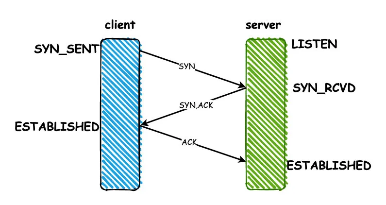
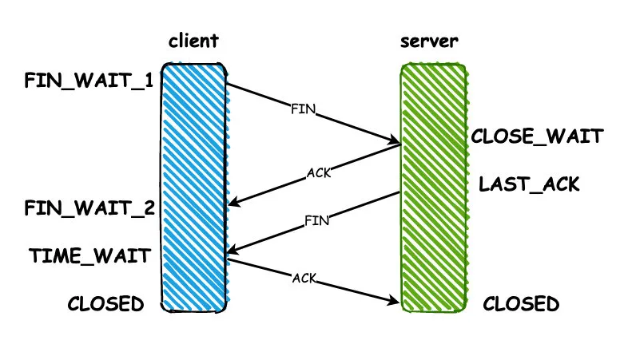
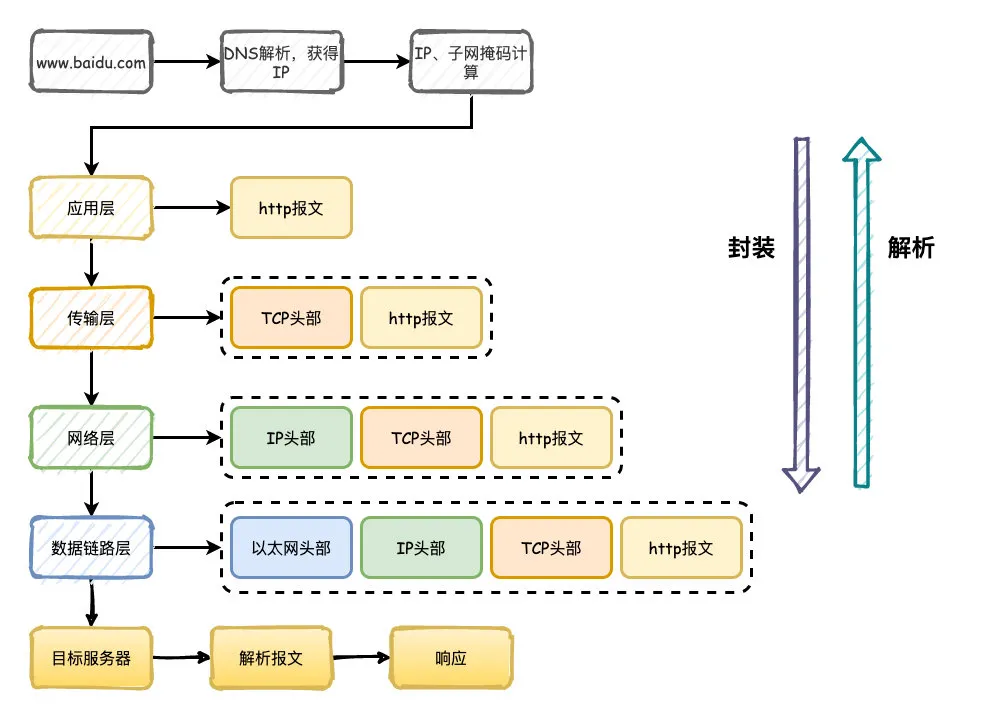
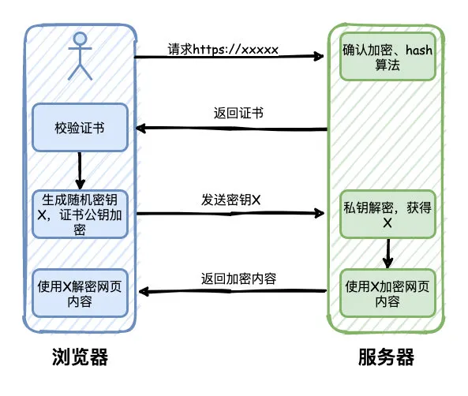
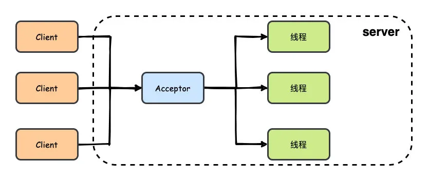
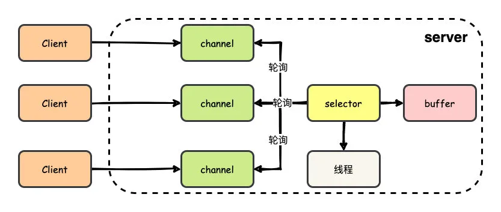
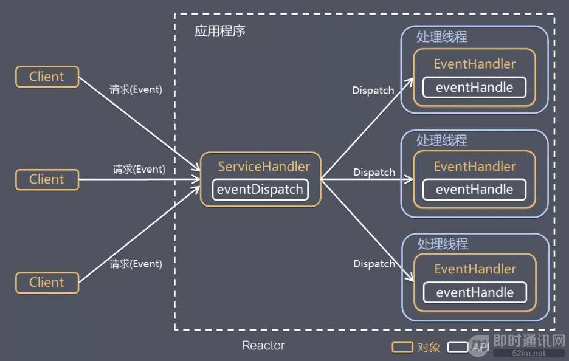
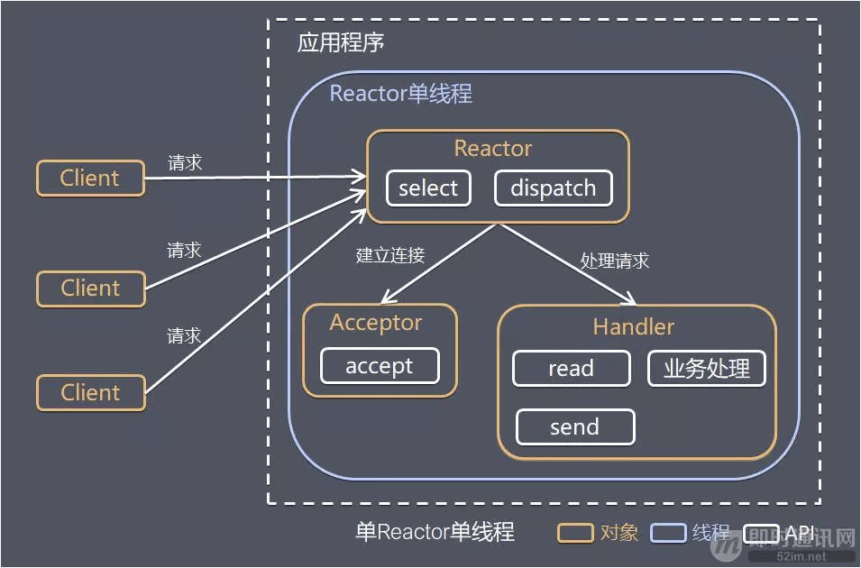
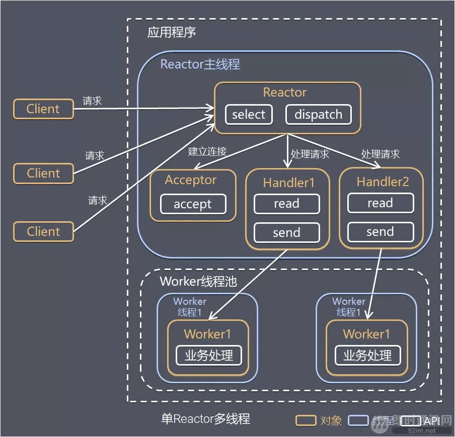

### 3次握手
- 核心是让收发双方都知道自己和对方具有收发能力
- 客户端向服务端发请求，服务端收到后，服务端知道自己有接受能力，客户端有发送能力
- 服务端向客户端发请求，客户端收到后，客户端知道自己有收发能力，服务端有收发能力
- 这个时候服务端还不知道自己是否有发送能力、客户端是否有接收能力，所以需要第三次握手，客户端向服务端发请求，服务端知道自己有收发能力，客户端有收发能力
  
具体来讲就是：
1. client端建立连接，发送一个SYN同步包，发送之后状态变成SYN_SENT
2. server端收到SYN之后，同意建立连接，返回一个ACK响应，同时也会给client发送一个SYN包，发送完成之后状态变为SYN_RCVD
3. client端收到server的ACK之后，状态变为ESTABLISHED，返回ACK给server端。server收到之后状态也变为ESTABLISHED，连接建立完成。
   

### 4次挥手
TCP协议是双向对等的传输协议，双方都可以向对方传输数据，接收对方的数据，所以要关闭连接的时候，A先给B指令（FIN），B接收到之后，回一个ACK，将一个方向上的连接关闭，但此时另一个方向的数据传输还在继续，等到传输完毕之后，B再给A发指令，A收到之后同样返回一个ack，将另一个方向上的连接关闭

具体来讲就是：
1. client端向server发送FIN包，进入FIN_WAIT_1状态，这代表client端已经没有数据要发送了
2. server端收到之后，返回一个ACK，进入CLOSE_WAIT等待关闭的状态，因为server端可能还有没有发送完成的数据
3. 等到server端数据都发送完毕之后，server端就向client发送FIN，进入LAST_ACK状态
4. client收到ACK之后，进入TIME_WAIT的状态，同时回复ACK，server收到之后直接进入CLOSED状态，连接关闭。但是client要等待2MSL(报文最大生存时间)的时间，才会进入CLOSED状态。
   

### 为什么要等待2MSL的时间才关闭？
1. 为了保证连接的可靠关闭。如果server没有收到最后一个ACK，那么就会重发FIN。
2. 为了避免端口重用带来的数据混淆。如果client直接进入CLOSED状态，又用相同端口号向server建立一个连接，上一次连接的部分数据在网络中延迟到达server，数据就可能发生污染。

### TCP怎么保证传输过程的可靠性？
- 校验和：发送方在发送数据之前计算校验和，接收方收到数据后同样计算，如果不一致，那么传输有误。
- 确认应答，序列号：TCP进行传输时数据都进行了编号，每次接收方返回ACK都有确认序列号。
- 超时重传：如果发送方发送数据一段时间后没有收到ACK，那么就重发数据。
- 连接管理：三次握手和四次挥手的过程。
- 流量控制：TCP协议报头包含16位的窗口大小，接收方会在返回ACK时同时把自己的即时窗口填入，发送方就根据报文中窗口的大小控制发送速度。

### 浏览器请求一个网址的过程
1. 首先通过DNS服务器把域名解析成IP地址，通过IP和子网掩码判断是否属于同一个子网
2. 构造应用层请求http报文，传输层添加TCP/UDP头部，网络层添加IP头部，数据链路层添加以太网协议头部
3. 数据经过路由器、交换机转发，最终达到目标服务器，目标服务器同样解析数据，最终拿到http报文，按照对应的程序的逻辑响应回去。
   

### HTTPS的工作原理
1. 用户通过浏览器请求https网站，服务器收到请求，选择浏览器支持的加密和hash算法，同时返回数字证书给浏览器，包含颁发机构、网址、公钥、证书有效期等信息。
2. 浏览器对证书的内容进行校验，如果有问题，则会有一个提示警告。否则，就生成一个随机数X，同时使用证书中的公钥进行加密，并且发送给服务器。
3. 服务器收到之后，使用私钥解密，得到随机数X，然后使用X对网页内容进行加密，返回给浏览器
4. 浏览器则使用X和之前约定的加密算法进行解密，得到最终的网页内容
   

### BIO、NIO、AIO
- BIO: blocking IO，同步阻塞式IO，每一个客户端连接，服务端都会对应一个处理线程，对于没有分配到处理线程的连接就会被阻塞或者拒绝。相当于是一个连接一个线程。
  
- NIO: non-blocking IO，同步非阻塞式IO，同步非阻塞IO，基于Reactor模型，客户端和channel进行通信，channel可以进行读写操作，通过多路复用器selector来轮询注册在其上的channel，而后再进行IO操作。这样的话，在进行IO操作的时候再用一个线程去处理就可以了，也就是一个请求一个线程。实现了多路复用
  
- AIO：asynchronous IO，异步非阻塞IO，完全由操作系统来完成请求的处理，然后通知服务端开启线程去进行处理，因此是一个有效请求一个线程。异步操作基于事件和回调机制实现

### 那么你怎么理解同步和阻塞？
首先，可以认为一个IO操作包含两个部分：
1. 发起IO请求
2. 实际的IO读写操作
- 同步和异步在于第二个，实际的IO读写操作，如果操作系统帮你完成了再通知你，那就是异步，否则都叫做同步。
- 阻塞和非阻塞在于第一个，发起IO请求，对于NIO来说通过channel发起IO操作请求后，其实就返回了，所以是非阻塞。

### Reactor 模式
#### 传统BIO存在的两个问题
1. 当并发数较大时，需要创建大量线程来处理连接，系统资源占用较大
2. 连接建立后，如果当前线程暂时没有数据可读，则线程就阻塞在 Read 操作上，造成线程资源浪费

#### Reactor针对这两个问题的解决方案
1. 基于 I/O 复用模型：多个连接共用一个阻塞对象，应用程序只需要在一个阻塞对象上等待，无需阻塞等待所有连接。当某条连接有新的数据可以处理时，操作系统通知应用程序，线程从阻塞状态返回，开始进行业务处理；
2. 基于线程池复用线程资源：不必再为每个连接创建线程，将连接完成后的业务处理任务分配给线程进行处理，一个线程可以处理多个连接的业务。

#### 基本模型

- 服务端程序处理传入多路请求，并将它们同步分派给请求对应的处理线程，即 I/O 多路复用统一监听事件，收到事件后分发(Dispatch 给某进程)，是编写高性能网络服务器的必备技术之一。

根据 Reactor 的数量和处理资源池线程的数量不同，有 3 种典型的实现：
1. 单 Reactor 单线程；
2. 单 Reactor 多线程；
3. 主从 Reactor 多线程。
   
#### 单 Reactor 单线程

方案说明：
1. Reactor 对象通过 Select 监控客户端请求事件，收到事件后通过 Dispatch 进行分发；
2. 如果是建立连接请求事件，则由 Acceptor 通过 Accept 处理连接请求，然后创建一个 Handler 对象处理连接完成后的后续业务处理；
3. 如果不是建立连接事件，则 Reactor 会分发调用连接对应的 Handler 来响应；
4. Handler 会完成 Read→业务处理→Send 的完整业务流程。
- 优点：模型简单，没有多线程、进程通信、竞争的问题，全部都在一个线程中完成。
- 缺点：性能问题，只有一个线程，无法完全发挥多核 CPU 的性能。Handler 在处理某个连接上的业务时，整个进程无法处理其他连接事件，很容易导致性能瓶颈。
- 可靠性问题：线程意外跑飞，或者进入死循环，会导致整个系统通信模块不可用，不能接收和处理外部消息，造成节点故障。
- 使用场景：客户端的数量有限，业务处理非常快速，比如 Redis，业务处理的时间复杂度 O(1)。

#### 单 Reactor 多线程

方案说明：
1. Reactor 对象通过 Select 监控客户端请求事件，收到事件后通过 Dispatch 进行分发；
2. 如果是建立连接请求事件，则由 Acceptor 通过 Accept 处理连接请求，然后创建一个 Handler 对象处理连接完成后续的各种事件；
3. 如果不是建立连接事件，则 Reactor 会分发调用连接对应的 Handler 来响应；
4. Handler 只负责响应事件，不做具体业务处理，通过 Read 读取数据后，会分发给后面的 Worker 线程池进行业务处理；
5. Worker 线程池会分配独立的线程完成真正的业务处理，如何将响应结果发给 Handler 进行处理；
6. Handler 收到响应结果后通过 Send 将响应结果返回给 Client。
- 优点：可以充分利用多核 CPU 的处理能力。
- 缺点：多线程数据共享和访问比较复杂；Reactor 承担所有事件的监听和响应，在单线程中运行，高并发场景下容易成为性能瓶颈。

#### 主从 Reactor 多线程
针对单 Reactor 多线程模型中，Reactor 在单线程中运行，高并发场景下容易成为性能瓶颈，可以让 Reactor 在多线程中运行。

方案说明：
1. Reactor 主线程 MainReactor 对象通过 Select 监控建立连接事件，收到事件后通过 Acceptor 接收，处理建立连接事件；
2. Acceptor 处理建立连接事件后，MainReactor 将连接分配 Reactor 子线程给 SubReactor 进行处理；
3. SubReactor 将连接加入连接队列进行监听，并创建一个 Handler 用于处理各种连接事件；
4. 当有新的事件发生时，SubReactor 会调用连接对应的 Handler 进行响应；
5. Handler 通过 Read 读取数据后，会分发给后面的 Worker 线程池进行业务处理；
6. Worker 线程池会分配独立的线程完成真正的业务处理，如何将响应结果发给 Handler 进行处理；
7. Handler 收到响应结果后通过 Send 将响应结果返回给 Client。
- 优点：父线程与子线程的数据交互简单职责明确，父线程只需要接收新连接，把新连接传给子线程，子线程无需返回数据，完成后续的业务处理即可。
- 这种模型在许多项目中广泛使用，包括 Nginx 主从 Reactor 多进程模型，Memcached 主从多线程，Netty 主从多线程模型的支持。